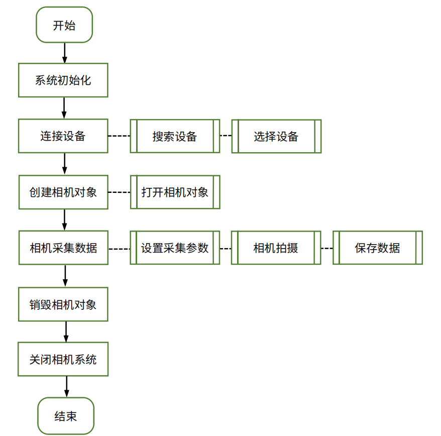

# 基础流程

RVC 相机调用的逻辑流程图如下。



API 接口详细说明可查看安装目录下的文档：

Windows 系统：/RVCSDK/docs/RVC SDK Documentation.html

Linux 系统：/opt/RVC/docs/RVC SDK Documentation.html

运行错误代码可查看安装目录下的文件：

Windows 系统：/RVCSDK/docs/ErrorCode.csv

Linux 系统：/opt/RVC/docs/ErrorCode.csv

图像获取基础流程及示例代码如下。

## 1. 系统初始化

硬件准备工作完成后，首先必须初始化 RVC 系统。执行下列代码：

```cs
RVC_CSharp.System.Init();
```

## 2. 连接设备

### a. 查找设备

查找设备有两种方式，一种是根据设备类型查找，一种是根据序列号查找。

根据设备类型查找：SystemListDeviceType 可选 USB（USB 相机）、GigE（网口相机）、All（所有类型相机）。以查找网口相机并选取列表中的第 1 台设备为例：

```cs
List<Device> devices = RVC_CSharp.System.ListDevices(SystemListDeviceType.GigE);
Device d1 = devices[0];
```

根据序列号查找：以查找序列号为 P2GM630W002 的设备为例。

```cs
Device d1 = new Device();
RVC_CSharp.System.FindDevice("P2GM630W002", ref d1);
```

### b. 查看设备信息

通过 GetDeviceInfo()函数的返回值，可获取设备连接状态。true 代表已连接且成功获取相机驱动，false 代表相机不可用。

设备信息中各字段的含义见下表。

| 字段 | 含义 | 数据类型 | 取值说明 |
| ---- | ---- | -------- | -------- |
| name | 相机名称 | char | - |
| sn | 相机序列号 | char | - |
| factorydate | 出厂日期 | char | - |
| port | 端口 | char | - |
| type | 支持端口类型 | enum | PortType_USB：USB 相机<br>PortType_GigE：网口相机 |
| cameraid | 相机 ID | enum | CameraID_Left：单目相机（左相机）<br>CameraID_Right：单目相机（右相机）<br>CameraID_Both：双目相机 |
| boardmodel | 主板型号 | int | - |
| support_x2 | 支持双相机 | bool | true：支持双相机<br>false：不支持双相机 |
| support_color | 支持光机投影颜色 | enum | 仅双目模式下可用。<br>ProjectorColor_Red：红色<br>ProjectorColor_Green：绿色<br>ProjectorColor_Blue：蓝色<br>ProjectorColor_White：白色 |
| workingdist_near_mm | 工作距离最小值（mm） | int | - |
| workingdist_far_mm | 工作距离最大值（mm） | int | - |
| firmware_version | 固件版本 | char | - |
| support_capture_mode | 支持拍摄模式 | enum | P/I/X 系列相机：<br>CaptureMode_Fast：快速模式<br>CaptureMode_Normal：标准模式<br>G 系列相机：<br>CaptureMode_Ultra：高精度模式<br>CaptureMode_Robust：抗干扰模式 |

## 3. 创建相机对象

### a. 创建相机对象

选取 1 台设备，创建相机对象。由设备信息中的 cameraid 字段，可查看当前相机对象可使用的 ID。

单目相机：只能创建 X1 对象，且必须与 DeviceInfo 中的 ID 保持一致，使用 CameraID_Left 或 CameraID_Right。下面代码可调用设备列表中的相机 d1，使用单目模式左相机，创建一个 X1 对象 x1。

```cs
X1 x1 = RVC_CSharp.X1.Create(d1, CameraID.CameraID_Left);
```

双目相机：可创建 X1 对象与 X2 对象。创建 X1 对象时可选择使用 CameraID_Left（左相机）或 CameraID_Right（右相机），使用方法同单目相机；创建 X2 对象时使用双目模式。下面代码可调用设备列表中的设备 device，创建一个 X2 对象 x2。

```cs
x2 = X2.Create(devices);
```

### b. 打开相机

以打开 x1 为例。

```cs
x1.Open();
```

通过 IsOpen() 函数的返回值，可判断当前相机是否打开且可用。

## 4. 相机采集数据

### a. 设置拍摄参数并采集

相机采集的常规步骤是先设置拍摄参数，再调用 Capture() 或 Capture2D() 函数进行点云与图像采集。下面以单目模式为例进行说明。

如果需要手动修改各项参数，可使用方法一或方法二。各项参数的详细介绍见[参数设置](CSharpParameter.md)。在实际应用中，建议直接使用相机内部的参数，或从参数配置文件中加载参数，详见方法三与方法四。

**方法一**：使用系统默认参数，并修改。

```cs
X1.CaptureOptions options = X1.CaptureOptions.Default();
//TODO:modify options
```

使用修改后的 options 作为拍摄参数，调用 Capture() 函数，采集 1 帧点云与 1 帧 2D 图：

```cs
ret = x1.Capture(options);
```

使用修改后的 options 作为拍摄参数，调用 Capture2D() 函数，仅采集 1 帧 2D 图：

```cs
ret = x1.Capture2D(options);
```

采集完成后，修改后的参数将写入相机。

**方法二**：加载相机的内部参数，并修改。

```cs
X1.CaptureOptions options = new X1.CaptureOptions();
x1.LoadCaptureOptionParameters(ref options);
// TODO:modify options
```

使用修改后的 options 作为拍摄参数，调用 Capture() 函数，采集 1 帧点云与 1 帧 2D 图：

```cs
ret = x1.Capture(options);
```

使用修改后的 options 作为拍摄参数，调用 Capture2D() 函数，仅采集 1 帧 2D 图：

```cs
ret = x1.Capture2D(options);
```

采集完成后，修改后的参数将写入相机。

**方法三**：直接使用相机内部参数。可先在 RVCManager 软件中完成调参，将参数写入相机，之后在 SDK 中直接调用相机内存储的参数。

调用 Capture() 函数，采集 1 帧点云与 1 帧 2D 图。Capture() 函数的参数缺省时，将直接使用相机内部存储的参数。

```cs
ret = x1.Capture();
```

调用 Capture2D() 函数，仅采集 1 帧 2D 图。Capture2D() 函数的参数缺省时，将直接使用相机内部存储的参数。

```cs
ret = x1.Capture2D();
```

**方法四**：从配置文件中加载参数，并拍摄。如果需要同时调用多台相机进行拍摄，可将不同相机的拍摄参数保存为配置文件，在拍摄前导入配置文件以获取参数。

```cs
ret = x1.LoadSettingFromFile("file.json");
```

调用 Capture() 函数，采集 1 帧点云与 1 帧 2D 图。Capture() 函数的参数缺省时，将直接使用相机内部存储的参数。

```cs
ret = x1.Capture();
```

调用 Capture2D() 函数，仅采集 1 帧 2D 图。Capture2D() 函数的参数缺省时，将直接使用相机内部存储的参数。

```cs
ret = x1.Capture2D();
```

!!! attention "注意"
    导入参数前，需检查配置文件中的参数是否适用于当前连接的相机，否则可能出现异常。
建议在同型号的相机之间导出/载入参数，并确保拍摄环境类似。

### b. 保存数据

若采集成功，可通过下面代码保存.ply+ASCII 格式的 3D 点云。

```cs
PointMap pointMap = x1.GetPointMap();
pointMap.SavePlyAscii(true,"./pointCloud.ply");
```

由于 ASCII 保存较慢，也可调用 SavePlyBinary() 函数，使用二进制保存。

```cs
PointMap pointMap = x1.GetPointMap();
string pointCloudFile = $"./{info.name}-{info.sn}/PointCloud.ply";
pointMap.SavePlyBinary(pointCloudFile);
```

SaveColorPointCloud() 函数可保存彩色点云。

```cs
Image image = x1.GetImage();
PointMap pointMap = x1.GetPointMap();
string colorPointCloudFile = $"./{info.name}-{info.sn}/{i}-ColorPointCloud.ply";
pointMap.SaveColorPointCloud(image, colorPointCloudFile);
```

可通过下面代码保存 2D 图像。

```cs
Image image = x1.GetImage();
image.SaveImage("./image-ori.bmp");
```

如需获取并保存深度图，可执行如下代码。

```cs
Mat mat = depthMap.ToMat();
mat.SaveImage("./depthMap-opencv.tiff");
```

## 5. 销毁相机对象

```cs
x1.Close();
X1.Destroy(x1);
```

## 6. 关闭相机系统

```cs
RVC_CSharp.System.Shutdown();
```