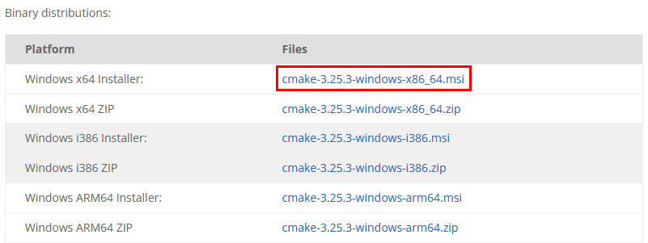

# Windows

## 运行环境搭建

Windows 环境下，RVC SDK 在安装过程中会自动将运行库添加进系统路径，具体运行库信息可查看安装目录下的文件：

/RVCSDK/examples/CSharp/CMakeLists.txt

使用 RVC SDK 进行 C# 开发时，需先按本节步骤完成环境配置与示例编译，并将所生成 bin/Debug 文件夹下的 RVC_C.dll、RVC_CSharp.dll、RVC_CSharp_Extension.dll 文件全部拷贝到.exe 可执行程序的同一目录下。

下面简述在 Win 10 系统下配置 C++ 运行环境的步骤。

### 1. 安装 CMake

CMake下载地址：<https://cmake.org/download/>

下载适配当前系统版本的.msi 文件。安装时，需要将 CMake 安装路径添加到系统路径。

### 2. 安装 Visual Studio

建议安装版本：VS 2019 或 VS 2017。

### 3. 添加 C# 负载

打开 Visual Studio Installer，点击【修改】。

打开“工作负荷”选项卡，勾选“.NET 桌面开发”与“使用 C++ 的桌面开发”，点击【修改】，安装 C# 负载。

在 Visual Studio 中打开解决方案 RVC_CSharp。如果项目后显示“已卸载”或“加载失败”，需再次打开 Visual Studio Installer，点击【修改】，在“单个组件”选项卡中，勾选.NET Framework 4.6.1 目标包及.NET Framework 4.6.1 SDK，点击【修改】，进行安装。完成安装后选中项目，右键选择重新加载即可。

## 例程配置步骤

### 1. 创建 build 文件夹

进入安装目录下的路径：/RVCSDK/examples/CSharp，手动创建 build 文件夹。

### 2. CMake 编译配置

打开 CMake，配置以下两项路径。

Where is the source code 选择安装目录下的路径：/RVC SDK/examples/CSharp

Where to build the binaries 选择安装目录下的路径：/RVC SDK/examples/CSharp/build

点击 Configure，选择使用的 VS 版本（建议选择 VS 16 2019），项目平台选择 x64 系统，单击 Finish。

如果需要将获取的数据转换为 Halcon 或 VisionPro 格式，需先获取 Halcon 或 VisionPro的 License，并在 CMake 配置过程中对应勾选 Halcon_Enable 或 VisionPro_Enable 选项。

配置成功后，提示 Configuring done。单击 Generate，成功后提示 Generating done。

### 3. 生成解决方案

编译完成后，在 Visual Studio 中再次打开项目。在解决方案资源管理器中选择：解决方案“RVC_CSharp”，右键单击，选择“生成解决方案”。

生成完成后，选择需要运行的例程，右键单击，选择“设为启动项目”。

在菜单栏选择 Debug | x64，点击“启动”。

例程运行完成后，拍摄的点云、2D 图、深度图将按拍摄设备名称分类，默认保存在当前执行路径的文件夹：

/RVCSDK/examples/CSharp/build/bin/Debug