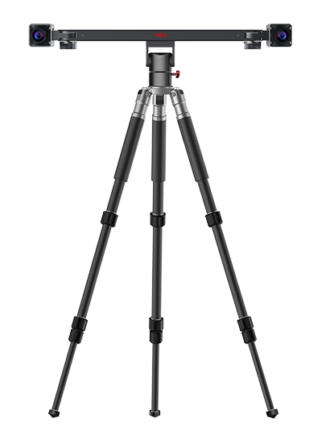

# 产品介绍

VDA 视觉位移分析仪 (Visual Displacement Analyzer) 利用自主研发的超高精度图像插值、位移跟踪、近距和远距高精度视觉标定等核心算法，通过对两幅或多幅图像中图案或像素变化的监测及分析，精确跟踪被测目标物体上各点的移动。VDA 充分利用 GPU 对算法进行加速，在保证分析精度的同时，实现二维和三维形貌、位移、变形、应变、振动、速度、加速度等信息的实时、高精度监测。

VDA 含全场应变测量仪、刚体位移分析仪两类产品系列，提供轻量一体式、灵活分离式、灵活单体式等多种选型，支持 2D、3D 标定与分析。

| 产品 | 特点 | 应用场景 | 控制软件 |
| :----: | ---- | ---- | :----: |
| **VDA 全场应变测量仪**  | 一体式结构设计 高速实时分析 超高精度分析 1 分钟快速标定 | 拉伸压缩剪切、弯曲、疲劳试验、滞回曲线、结构模型静载和动载、高温拉伸、巴西圆盘、离心机边坡试验、模拟采矿相似模拟试验、杯凸试验 | **VDAStrainAnalyzer**  |
| **VDA 刚性位移分析仪**  | 超远距离、超大视野三维测量 高精度实时分析 轻便式结构设计 1 分钟快速标定 | 风洞、拉伸压缩剪切、弯曲、振动台、疲劳试验、滞回曲线、结构模型静载和动载、输电塔输电线模型加载、高温拉伸、波流水槽试验、水下模型 | **VDARigidAnalyzer**  |

---
## 产品信息

- 查看产品详细介绍，请点击如本科技官网 VDA 产品页 <https://www.rvbust.com/products-detail/vda.html>。

- 查看产品配置参数，请点击 [VDA 产品参数](user_guide/datasheet.md)。查看软件技术参数，请点击 [软件技术参数](vda_analyzer/index.md)。

- 浏览更多产品信息、应用案例，请点击如本科技官网 <https://www.rvbust.com>。

## 文档索引

- 学习安装、使用 VDA 分析仪，了解设备操作与维护事项，请查阅 [**VDA 产品使用手册**](user_guide/index.md) 。

- 学习使用 VDA Analyzer 软件进行标定与分析，请查阅 [**VDA Analyzer 使用手册**](vda_analyzer/index.md)。

---