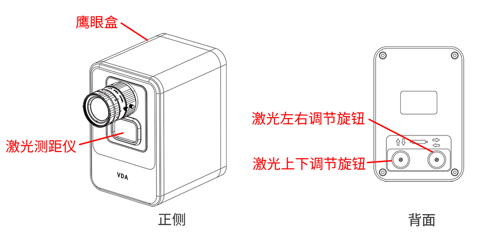
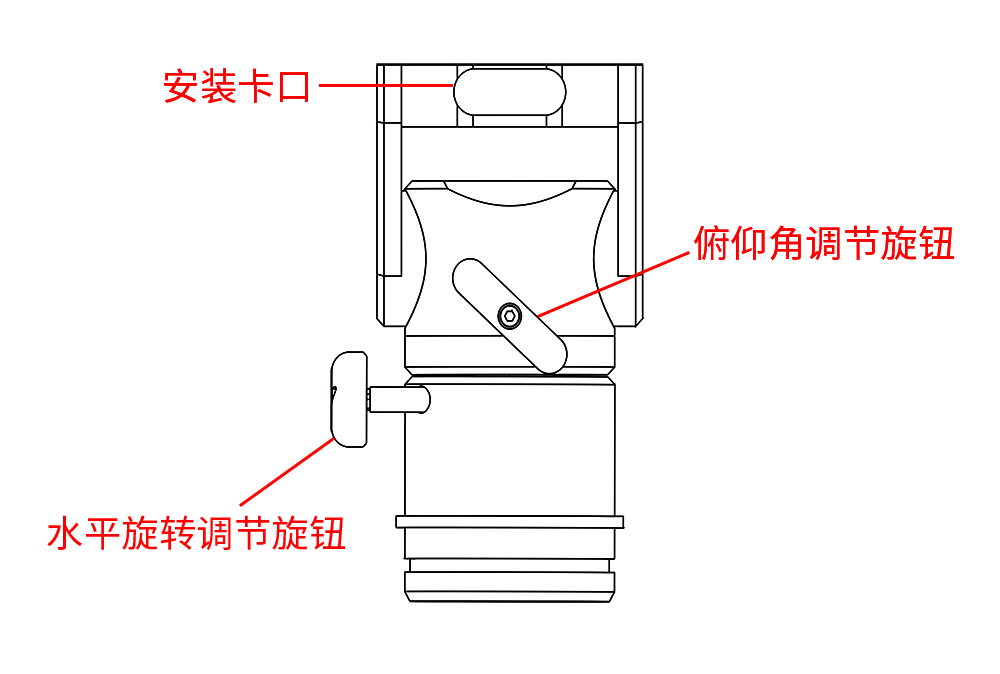

# 产品安装

## 安装注意事项

### 操作须知

- 操作前请熟悉仪器的构造、性能以及各项操作注意事项。操作过程中，请保持手部动作柔稳，请尽量选择地势平坦的区域进行设备安装。

- 仪器开箱前，请将仪器箱平放于地面，严禁上下颠倒仪器箱，以免仪器在开箱时落地损坏。开箱后应查看仪器在箱内放置的状态，使用完毕后按原样入箱。

- 操作中应避免用手触及镜头和激光测距仪，有灰尘或污渍时请使用气吹、软毛刷、擦拭纸处理。严禁使用手指、衣物、手帕、纸巾和其他硬质物品或腐蚀性化学物品等擦拭。

- 当仪器旋转失灵或转动过程有杂音时，应立即暂停操作并查明原因妥善处置。请勿强力扳扭或拆卸、锤击仪器。

- 仪器及所用部件取出后，应及时合上仪器箱，以免沙土杂草进入箱内。严禁坐、踏仪器箱。

### 电脑配置要求

与 VDA 适配的笔记本电脑/工控机推荐配置如下。

|  | 笔记本电脑 | 工控机 | 
| - | ---- | ---- |
| **处理器** | 英特尔 酷睿 i7 | 英特尔 酷睿 i9 |
| **内存** | 32G | 32G |
| **硬盘** | 1T 固态硬盘 | 2T 固态硬盘 |
| **操作系统** | Win 10 | Win 10 |
| **数据接口** | 2 个 USB3.0 接口 | 2 个万兆网口，1 个 PCIe 接口（采集卡） |

## 拆箱

打开 VDA 设备手提箱，内有图像采集模块、镜头与线缆。三脚架与云台另附于收纳袋中。

| 部件 | 图示 | 结构说明 |
| ---- | ---- | ---- |
| 图像采集模块 | 3D 版本：    2D 版本：   | 图像采集模块分为 3D 与 2D 版本。 3D 版本含 2 个鹰眼盒，固定在铝合金平台上。铝合金平台两端有旋钮，可调节鹰眼盒水平角度。鹰眼盒内置有相机，可安装镜头。 2D 版本为 1 个鹰眼盒，鹰眼盒内置有激光测距仪与相机，可安装镜头，激光方向调节按钮位于鹰眼盒背面。 图像采集模块通过底部卡口与云台连接。 |
| 镜头 |  | 用于采集视频，提供图像数据。使用时安装在鹰眼盒的相机内。 | 
| 二自由度云台 |  | 用于调节图像采集模块左右、上下方向角度。云台设置两个旋钮，上方旋钮调节云台俯仰角，下方旋钮调节云台水平角度。 云台通过顶端卡口与图像采集模块连接。 |
| 三脚架 |  | VDA 测量仪的基座。脚管中段设置长度控制旋钮，顶部设置角度卡位块，可分别调节每条脚管的长度与伸展角度。 三脚架顶端的三角座上配有中轴卡位旋钮、限位簧片与水平仪，卡位旋钮与限位簧片用于固定云台，水平仪用于检查安装平面是否水平。 |

!!! caution "注意"
    3D 版本图像采集模块的平台固定在铝合金平台上，请勿擅自拆卸。

!!! caution "注意"
    本公司标配一组或多组不同焦距的镜头，可根据测量需求选配，参数选型表请查看 [产品参数](datasheet.md)。若擅自使用其他镜头或相机，可能影响测量分析的准确度。如需使用其他型号相机或镜头，请联系本公司销售。

## 安装

VDA 设备安装分为以下 3 步流程：

1) 安装三脚架与云台；2) 安装图像采集模块；3) 连接线缆。

<!--
安装三脚架->安装图像采集模块设备->安装镜头->连接线缆->打开软件，调整安装

1.稳定放置三脚架
2.打开VDA航空箱
3.取出水平横杆
4.将水平横杆安装于三脚架卡口上，拧紧横杠保证完全固定
5.取出镜头，安装于鹰眼上
6.取出数据线，连接水平横杆接口和笔记本
7.打开笔记本中VDA软件
8.调整水平横杆和鹰眼相机角度同时观察软件界面对鹰眼做微调，使目标区域出现在软件视野中央
9.调整相机镜头光圈和焦距，保障最佳效果，目标清晰
10.开始VDA数据分析
-->

### 1. 安装三脚架与云台

!!! caution "注意"
    请在稳定、可靠的地面上进行操作，并确保安装、测量过程中三脚架底部不会滑动。

(1) 从设备箱中取出三脚架。旋松脚管上的长度控制旋钮，将三脚架伸长至所需长度。

(2) 调整三脚架，使其上表面基本水平，将底部的三个长度控制旋钮全部拧紧。

(3) 展开三脚架，将三脚架立于稳定、可靠的地面。

(4) 放置云台。将三脚架顶部的卡位旋钮放松，将限位簧片拉出后放入云台，限位簧片会自动回弹。将卡位旋钮锁死。

!!! tip "提示"
    为方便后续操作，建议将云台的两个旋钮都朝向操作人员。

### 2. 安装图像采集模块

!!! caution "注意"
    如果选购的是分离式设备，请按两个 2D 图像采集模块进行安装。

!!! warning "警告"
    旋紧螺丝时请勿用力过大，否则可能损坏设备。 

!!! caution "注意"
    请不要直接手提相机，否则可能损坏或弄脏设备。

#### 3D 版本

(1) 打开设备箱，双手分别握住图像采集模块的两端，将其从设备箱中取出。

(2) 将图像采集模块底部的凸起对准云台顶部的凹槽，放入后，拧紧云台顶部的旋钮。

(3) 调整鹰眼盒，避免其松动。将图像采集模块的两个相机盖取下，放回设备箱内。

(4) 从设备箱中取出镜头，将镜头盖取下并放回设备箱内。

(5) 将左镜头对准左相机内螺纹，轻旋并适当拧紧镜头。以同样的方法安装右镜头。

!!! caution "注意"
    左镜头必须安装于左相机，右镜头必须安装于右相机，否则会影响测量结果。

#### 2D 版本

(1) 打开设备箱，握紧鹰眼盒，将鹰眼盒从设备箱中取出。

(2) 将鹰眼盒底部的凸起对准云台顶部的凹槽，放入后，拧紧云台顶部旋钮。

(3) 将鹰眼盒相机盖取下，放回设备箱内。

(4) 从手提箱中取出镜头，将镜头盖取下并放回设备箱内。

(5) 将镜头对准相机内螺纹，轻旋并适当拧紧镜头。

### 3. 连接线缆

完成硬件组装之后，方可将 VDA 设备连接至笔记本或工控机。

- **连接笔记本**

    从设备箱中取出两条 USB3.0-MicroB 线缆。将 USB 端接入笔记本的 USB3.0 接口，将 MicroB 端接入 VDA 设备接口。

- **连接工控机**

    从设备箱中取出两条相机电源线缆、同步触发盒及万兆网线。将万兆网线的 RJ45 端口接入工控机万兆网接口，带锁定螺丝端接入 VDA 设备；将电源线缆与相机及同步触发盒连接后，接入电源。

## 设备加固

安装完成后，确认连接螺钉牢固锁定，确认三脚架各螺丝锁紧。之后建议对设备进行加固。

- 若在泥土地面测量，需将户外三脚架底部适当固定，以防仪器下沉。

- 若在斜坡上测量，需将仪器三脚架的两条脚支在坡下，另一条支在坡上。

- 若在光滑地面测量，需用细绳将三脚架的三个脚连接固定，以防三脚架打滑。

- 若在户外，为保证设备的稳定性，还可将仪器安装在浇筑混凝土墩上，或利用不动的稳定点来修正设备自身的偏移。
 
## 照明

测量环境采光不足时，应选用亮度适中的弥散光源进行照明，可在 VDA 设备上方安装探照灯。测试前需调整光源位置和角度，避免测试目标区域出现阴影或局部高光。