# 软件快速操作

VDA Analyzer 系列软件分为两个版本：全场应变 (VDA Strain Analyzer)、刚性体移 (VDA Rigid Analyzer)，分别适配 VDA 全场应变测量仪、VDA 刚性位移分析仪两款产品。两者用于不同类型的测量分析，软件安装与相机标定流程基本一致，分析操作区别较大。下文简述软件安装与操作基本流程。

## 软件使用流程

VDA Analyzer 支持在线/离线标定、在线/离线分析、视频流保存、分析数据回放，软件使用流程图如下。未连接 VDA 分析仪设备时，仅可使用流程 3/5/6，进行离线标定、离线分析、分析结果回放。

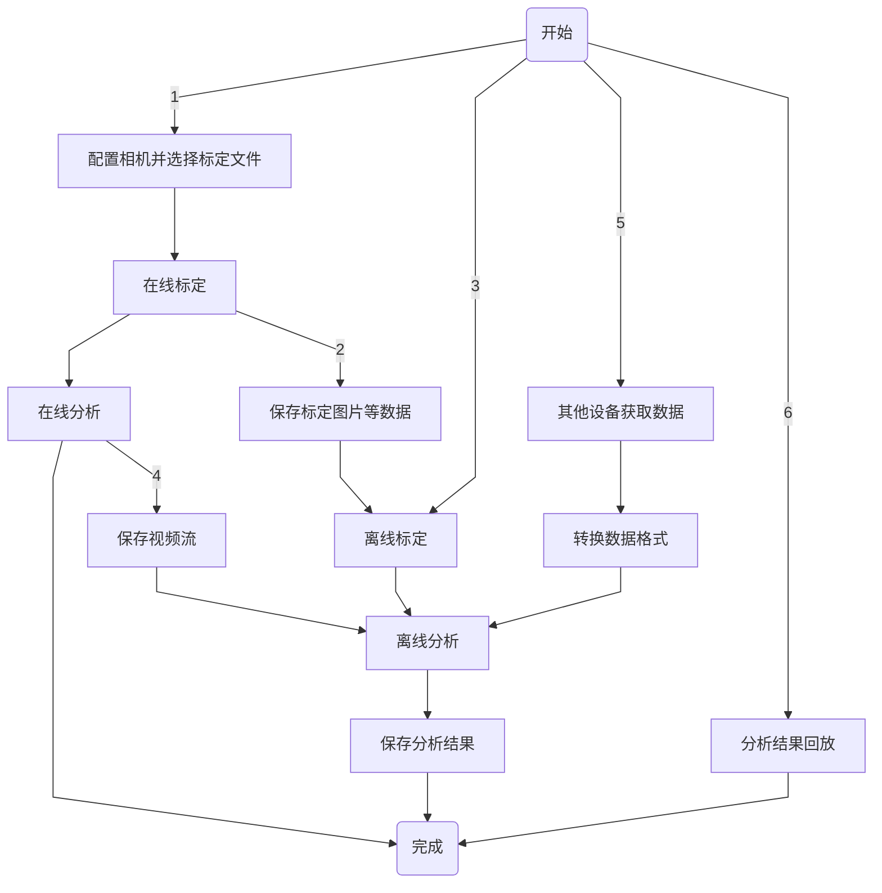

## 软件下载与安装

联系本公司销售或技术支持，获取 VDA Analyzer 软件安装包与加密狗。双击.exe 文件，根据指引完成安装。使用笔记本电脑/工控机的推荐配置如下。

|  | 笔记本电脑 | 工控机 | 
| ---- | ---- | ---- |
| **处理器** | 英特尔 酷睿 i7 | 英特尔 酷睿 i9 |
| **内存** | 32G | 32G |
| **硬盘** | 1T 固态硬盘 | 2T 固态硬盘 |
| **操作系统** | Win 10 | Win 10 |
| **数据接口** | 2 个 USB3.0 接口（用于线缆连接），1 个 USB2.0 及以上接口（用于加密狗连接） | 1 个 PCIe 接口（采集卡）、1 个万兆网卡、2 个万兆网口（用于线缆连接），1 个 USB2.0 及以上接口（用于加密狗连接） |

安装完成后，在笔记本/工控机的 USB2.0 及以上接口插入加密狗，即可使用软件。

## 设备调整

完成设备安装并确保电源可靠连接后，调整相机与标定板（或标记区域，后同）的位置。2D 版本应使标定板对准相机，3D 版本应使标定板居中对齐相机基线（即左、右相机光心连线中点）。

打开软件，进入主界面 → 在线标定配置区，选择设备与对应的镜头高精度文件，并在下拉框中选择“激光标定”或“多点标定”，点击【确认】打开在线标定页。

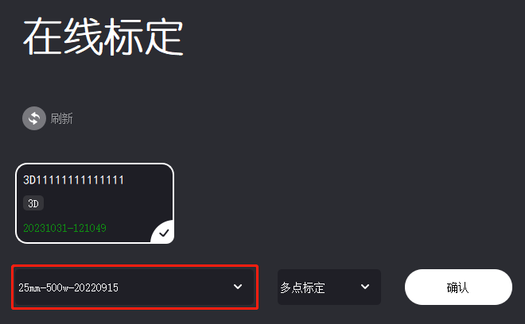

!!! caution "注意"
    如果未购买本公司工控机，主界面中镜头高精度文件将显示为空。请联系本公司客服获取高精度文件，将文件夹解压后拷贝至软件安装目录下的 CamCalibConfig 文件夹下。

### 视图基本操作

| 视图操作 | 方法 |
| ---- | ---- |
| 移动图像 | 左右移动：空格键 + 鼠标左键拖动 上下移动：鼠标滚轮滑动，或空格键 + 鼠标左键拖动 |
| 缩放图像 | 空格键 + 鼠标滚轮或 Ctrl + 鼠标滚轮 |
| 选点 | 鼠标左键单击  |
| 取消选点 | 鼠标右键单击 |
| 删除被测点 | 逐个删除：鼠标右键 删除指定被测点：Ctrl + 右键 |
| 移动被测点 | Ctrl + 鼠标左键拖动 |
| 修改指定被测点参数 | Ctrl + 鼠标左键，选中指定的被测点后进行参数修改。 |

### 调整视野

通过调节设备的高度以及俯仰角，调整测量视野。

- **2D 版本**

    (1) 调节三脚架，大致确定设备高度。

    (2) 调节云台旋钮，使得目标区域位于相机画面中间位置。调节完成后，锁死云台方向调节旋钮。

    (3) 如果需要调节设备俯仰，先松开云台上的旋钮，同时用单手轻扶鹰眼盒下半部分（请勿握持摄像和激光模块），平稳旋转调节视野后，锁死云台上的旋钮。

- **3D 版本**

    (1) 调节三脚架，大致确定设备高度。

    (2) 调节云台旋钮与铝合金平台两端的旋钮，使得目标区域均位于左、右相机画面的中间位置。调节完成后，锁死云台旋钮。

    (3) 如果需要调节设备俯仰，先松开相应的制动螺旋，同时用单手轻扶铝合金平台（请勿握持摄像和激光模块），平稳旋转调节视野后，锁死对应的制动旋钮。

### 调整焦距

如果成像不清晰，可使用镜头上的调焦旋钮调整焦距。

!!! caution "注意"
    请保证两个相机成像的清晰度。相机标定开始时，需要调节对焦质量；标定结束之后，请勿再次调节对焦旋钮，光圈旋钮可以更加实际情况选择是否调节。

### 调整曝光 

成像区域过曝时，应适当调小镜头的光圈旋钮，或降低环境光源强度；成像区域曝光不足时，应适当调大镜头的光圈旋钮，或增强环境光源强度。如果调节镜头结果不佳，可在 VDA Analyzer 软件中进入相机控制功能调节曝光值，操作详见 <a href="../../vda_analyzer/preparation/#CameraControl">准备工作 - 相机控制</a>。

!!! tip "提示" 
    测量环境光线强烈时，建议使用 11 及以上的光圈值；光线适中时，建议使用 4 至 11 的光圈值；光线较弱时，建议使用 4 以下的光圈值。

!!! caution "注意"
    对于 3D 版本，需确保左、右镜头的光圈一致。

## 标定

VDA Analyzer 提供激光标定、多点标定两种标定方法，用户可根据不同使用场景选择更适合的方式。

| 标定方法 | 支持标定模式 | 速度 | 设备要求 | 适用场景 | 
| ---- | ---- | ---- | ---- | ---- | 
| 激光标定 | 仅在线标定 | 相对较慢 | 必须带有激光测距仪 | 不方便放置标定板、距离太远、无法直接测量的场景。 | 
| 多点标定 | 在线标定、离线标定 | 相对较快 | 通用 | 可放置标定板、方便测量的场景。 |

!!! caution "注意"
    标定完成后，仅允许调节镜头光圈，不允许调节镜头焦距、挪动设备或被测物，否则会影响后续分析工作。

### 在线标定

#### 激光标定

!!! caution "注意"
    激光标定时选取的标定面不能反光，否则可能影响识别。

1. 在主界面 → 在线标定配置区，选择设备与对应的镜头高精度文件，在下拉框中选择“激光标定”，点击【确认】打开在线标定页。

2. 通过鹰眼盒背面的旋钮调整激光方向，使得相机视图中的激光点照射到所需的原点 O 的位置。对于 3D 版本，应调整左、右激光方向，使得左、右相机视图中，左激光点、右激光点与原点 O 的位置均重合。

3. 单击相机视图中的激光点中心处，触发激光测距，鹰眼盒至激光点的距离将自动记录在标定数据区。按同样的方法，依次用激光确定相机视图中点 X、点 Y 的位置，并完成相应的测距。

    !!! caution "注意"
        选择 X 点时，应使射线 OX 与期望的 x 轴正方向一致；选择 Y 点时，应使射线 OY 与 OX 大致垂直。

    !!! caution "注意"
        对于 3D 版本，左、右相机的激光点必须重合。激光点重合后，左、右相机都需要在视图中点击激光点触发测距。

    

4. 完成所有测距后，点击【标定】,计算完成后将弹出标定结果展示窗口。如果确定使用当前标定结果，点击【保存】，标定数据将自动保存至本地。

    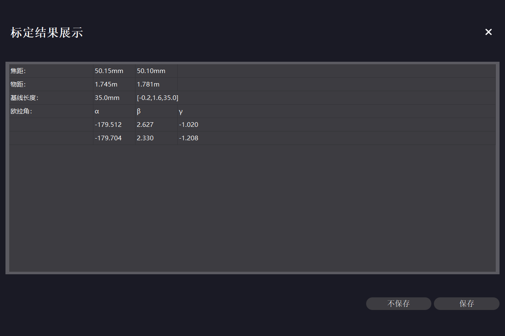

#### 多点标定

多点标定可自动识别标定板圆心，也可手动选点。若使用标定板进行标定，建议选择自动识别功能；若不方便放置标定板（如测量地点在户外且与设备距离较远），或自动识别失败，可采用手动选点。

在主界面 → 在线标定配置区，选择设备与对应的镜头高精度文件，在下拉框中选择“多点标定”，点击【确认】打开在线标定页。

**自动识别**：

!!! caution "注意"
    多点标定自动识别模式下，视野区域内不能有其他明显圆环，否则可能影响识别。

1. 使标定板尽可能位于相机视野中心位置。
    
2. 下拉选择标定板规格，在“识别方式”中点选“自动识别”。软件将自动检测标定板的 4 个圆心位置，相机视图中展示 4 个圆心与各点间的理论距离。

    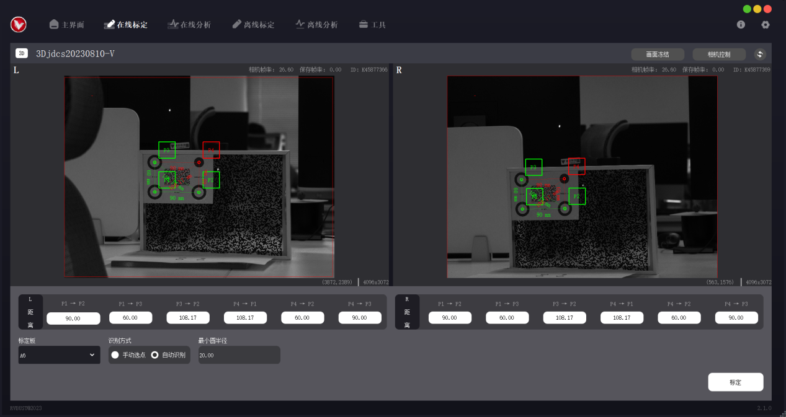

3. 完成自动识别后，点击【标定】。计算完成后将弹出标定结果展示窗口，视图中显示坐标系，下方显示标定数据。如果确定使用当前标定结果，点击【保存】，标定数据将自动保存至本地。

    

**手动选点**：    

1. 在“识别方式”中点选“手动选点”，标定板下拉框选择 NULL。
    
2. 在相机视图中用鼠标左键单击，依次选择 4 个点。P1、P2、P3 分别对应原点 O、x 轴正方向、y 轴正方向，P4 位于 xOy 平面内。如需取消选点，点击鼠标右键逐次取消。对于 3D 版本，需在左、右相机视图中按此操作分别依次选择 4 点，左、右相机视图中所选的点应按顺序一一对应。
    
    !!! caution "注意"
        选择 P2 点时，应使射线 P1P2 与期望的 x 轴正方向一致；选择 P3 点时，应使射线 OY 与 OX 大致垂直。

    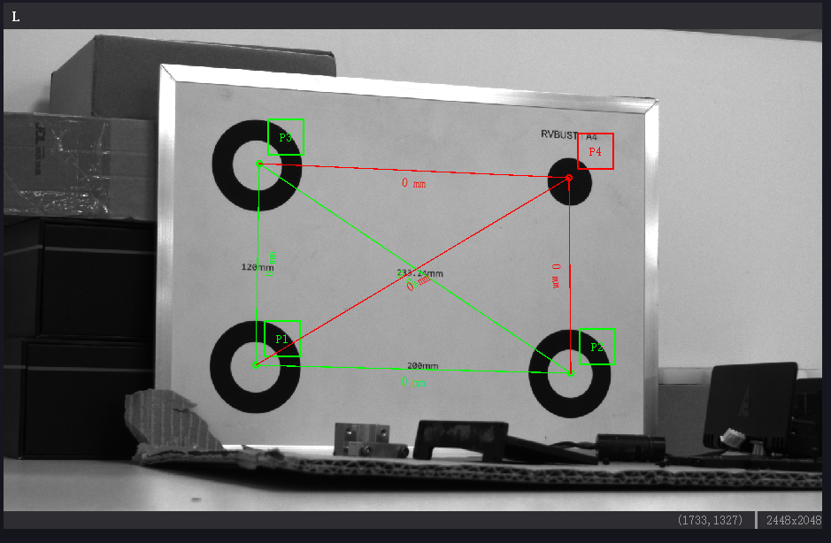

3. 通过实地测量或其他方法获取上述 4 点之间的实际距离值，在距离区中输入对应的距离值。数据填写完成后，视图上会显示距离信息，可对比实际物体，检查距离输入是否正确。
    
     

4. 点击【标定】。计算完成后将弹出标定结果展示窗口，视图中显示坐标系，下方显示标定数据。如果确定使用当前标定结果，点击【保存】，标定数据将自动保存至本地。

### 离线标定

用 VDA 采集的文件可进行离线标定。当标定结果需要更改时，可使用离线标定功能，利用标定文件复现在线标定场景，重新选点标定。

如果进行过标定，标定文件夹内会生成在线工程标定文件 31415926535A.txt。重新进行标定后，该文件中的标定数据会更新。需要使用新的标定结果时，可将更新后的文件 31415926535A.txt 拷贝至离线数据文件夹，替换之前的版本。

离线标定仅支持多点标定方法，操作步骤如下。

1. 准备离线标定文件夹。离线标定文件夹内的必要文件组成见下表。

    | 文件功能描述 | 2D 版本 | 3D 版本 |
    | ---- | ---- | ---- |
    | 相机高精度文件 | 31415926535A_L.txt | 31415926535A_L.txt（左相机） 31415926535A_R.txt（右相机） |
    | 相机相元大小及点位距离信息文件 | CalibrationMsg.txt | CalibrationMsg.txt |
    | 相机拍摄的标定区域图像 | calib_image.bmp | left_calib_image.bmp（左相机） right_calib_image.bmp（右相机） |

    获取离线标定文件夹的方式有 2 种：

    - 自动生成：VDA Analyzer 软件使用期间会自动触发拍照。采集的标定文件夹以“Calibration_拍摄时间”的形式命名，默认保存在安装路径下的 VDA_CameraFrame 文件夹内。进行离线标定时，可直接选取对应的文件夹。

    - 手动采集：点击【相机控制】，在“基础”选项中点击【拍照】，采集的图像默认保存在安装路径下的 VDA_CameraFrame 文件夹内。新建离线标定文件夹，按上述文件组成，将必备的文件拷贝至文件夹内，并修改图像文件名为指定形式。

        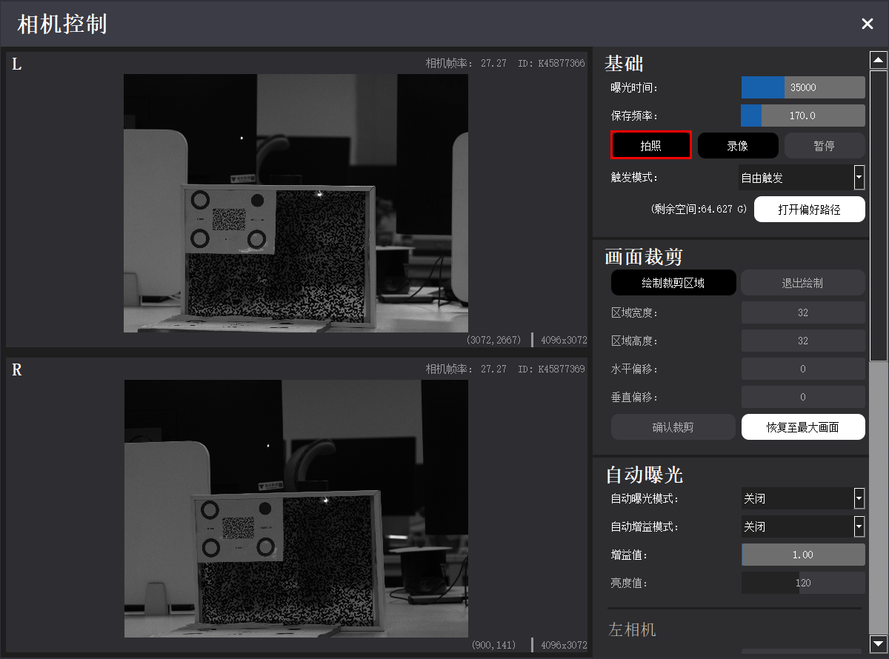

2. 在主界面 → 离线标定配置区，点击【打开标定文件夹】，选择离线标定文件夹。若文件被成功识别，界面将展示标定类型（2D 或 3D）及预览图。点击【下一步】，进入离线标定页。
    
    
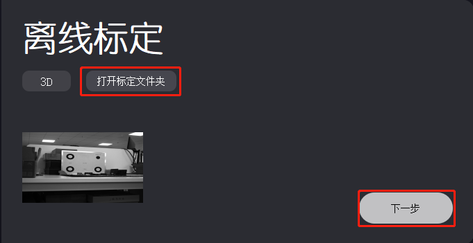
  

3. 进入离线标定页之后的操作步骤与 <a href="#MultiCalibration">在线多点标定</a> 一致。

### 标定结果参数说明

| 参数 | 2D 版本 | 3D 版本 |
| ---- | ---- | ---- |
| 焦距 | 当前设备使用的镜头焦距 | 当前设备使用的镜头焦距 |
| 物距 | 相机到物体的距离 | 左物距对应左相机到物体的距离，右物距对应右相机到物体的距离 |
| 基线长度 | 无 | 左、右镜头的中轴线距离 |
| 欧拉角 | α 数值对应 x 轴绕角，β 数值对应 y 轴绕角 | α 数值对应 x 轴绕角，β 数值对应 y 轴绕角，γ 数值数值对应 z 轴绕角 |

## 分析

### 在线分析

在线分析分为 2D 在线分析与 3D 在线分析。3D 在线分析要求设备必须进行过标定，2D 在线分析可以不标定。标定过的设备可分析实际位移 (mm)，未标定的设备只能分析像素位移。在线分析的基本操作步骤如下。

1. 在主界面 → 在线分析配置区，选择对应的设备，点击【确认】打开在线分析页。

    
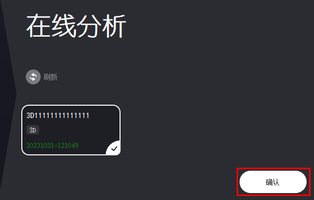
   

2. 点击【分析设置】，弹出分析参数设置窗口。全场应变版本在相机视图中选择感兴趣区域 ROI (Region of Interest)，刚性位移版本在相机视图中选择感兴趣点 POI (Point of Interest)。选取时的鼠标 + 键盘操作方式见下表。
    
    

    | ROI/POI 操作 | 方法 |
    | ---- | ---- | 
    | 添加 ROI/POI | 鼠标左键拖动。 |
    | 删除 ROI/POI | 鼠标右键单击，逐次取消之前选择的 ROI/POI。 Ctrl + 鼠标右键单击，选中指定的 ROI/POI 并删除。 |
    | 移动 ROI/POI | Ctrl + 鼠标左键拖动。 | 
    | 修改指定 POI 参数 | Ctrl + 鼠标左键，选中指定的 POI 后进行参数修改。 暂不支持对指定的 ROI 修改参数。 |

    

    

        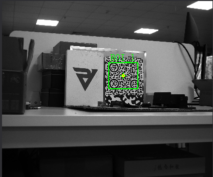
         
        
全场应变 ROI

    
    

    

        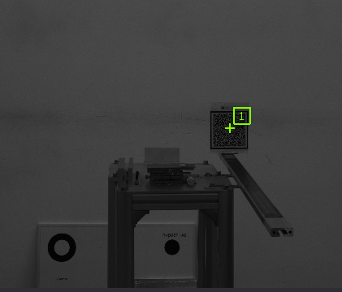
         
        
刚性位移 POI

    
  

3. 在分析参数设置窗口修改“子集宽度”“子集高度”数值，相机视图中将以黄色方框标记出子集区域。调整参数值，确保子集区域内包含足够多的纹理变化。其他分析参数可根据分析需求进行调整。参数解释详见 <a href="../../vda_analyzer/analysis_strain/#StrainPara">全场应变 - 分析参数分类说明</a>，<a href="../../vda_analyzer/analysis_rigid/#RigidPara">刚性位移 - 分析参数分类说明</a>。

    

        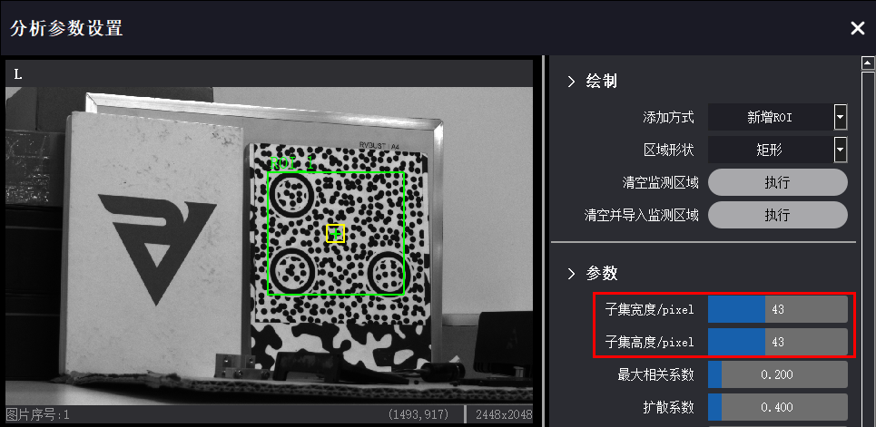
         
        
全场应变 ROI 子集大小

    
    

    

        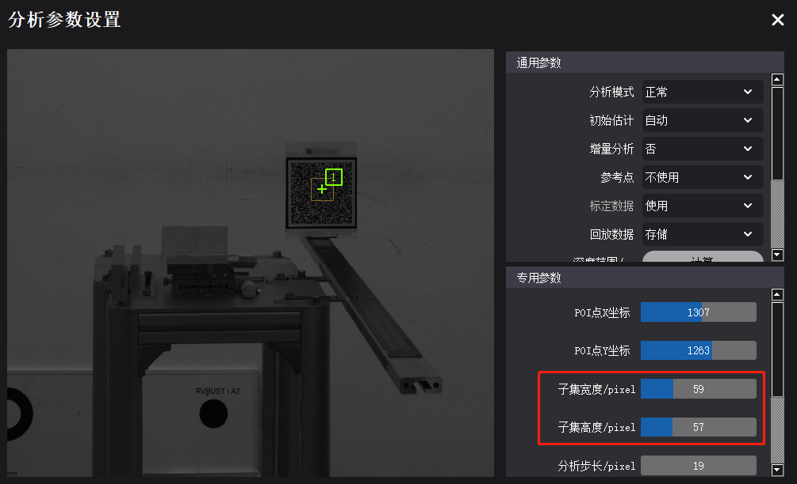
         
        
刚性位移 POI 子集大小

    
  

4. 关闭分析参数设置窗口，点击【开始分析】。若启动成功，全场应变版本将展示实时应变云图，刚性位移版本将展示实时位移曲线。

    

        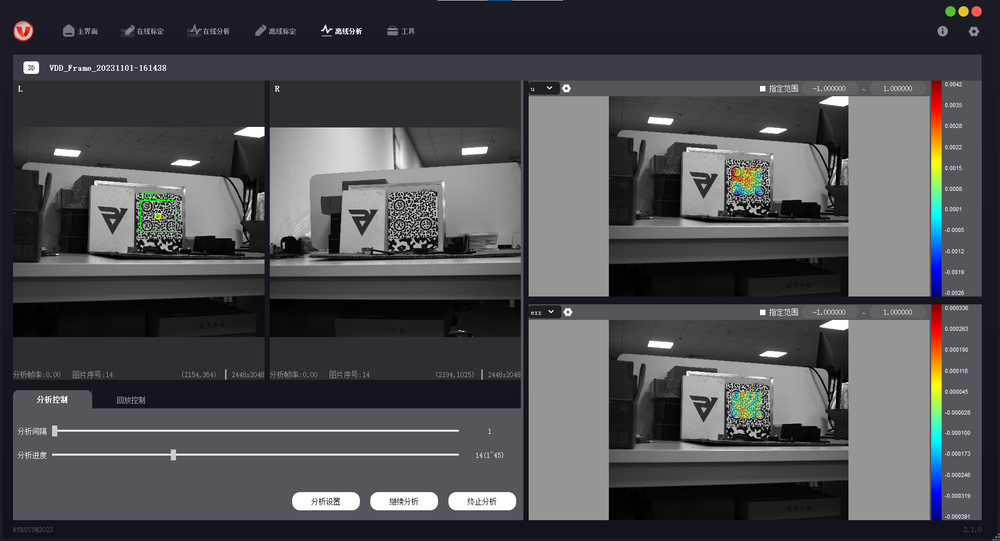
         
        
全场应变实时云图

    
    

    

        
         
        
刚性位移实时曲线

    
  

5. 对于 3D 在线分析，若未检测到深度信息，将出现提示框，跳转至深度计算。
   
    (1) 根据相机视图，判断被测物上距离相机基线最近、最远的点。
   
    (2) 根据提示，在左、右相机视图中，依次选择上一步中确定的最近点与最远点。左、右相机视图中的点位应依次对应。
    
    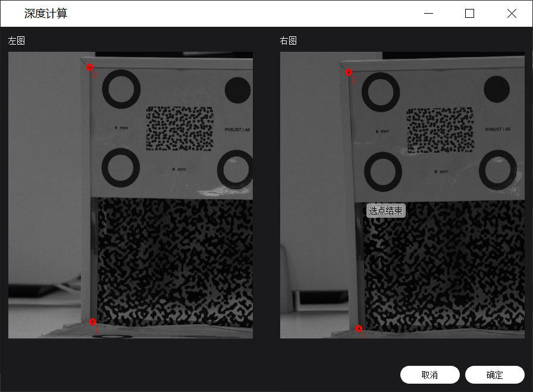

    (3) 进行深度计算完成后，点击【确定】，回到在线分析页。再次点击【开始分析】，即可启动分析。

### 离线分析

使用 VDA 采集的文件可进行离线分析。2D 离线分析还可使用其他来源的.bmp 图像，也可将其他格式的图片、视频转换为.bmp 图像序列，进行像素分析。3D 离线分析只能使用本软件录制的.vdd 格式视频，或将视频转换为.bmp 图像序列，进行位移分析。离线分析基本操作步骤如下。

1. 准备离线分析文件夹。离线分析文件夹内的必要文件组成见下表。

    | 文件功能描述 | 文件名 |
    | ---- | ------------ |
    | 相机标定文件 | 31415926535A.txt | 
    | 相机采集的视频或图像序列（格式需为.vdd 或.bmp，3D 版本左、右相机图像数量与命名需一一对应） | **.vdd 视频流**： img_00000001.vdd img_00000002.vdd img_00000003.vdd …… **.bmp 图像（2D 版本）**： left_00000001.bmp left_00000002.bmp left_00000003.bmp …… **.bmp 图像（3D 版本）**： left_00000001.bmp left_00000002.bmp left_00000003.bmp …… right_00000001.bmp right_00000002.bmp right_00000003.bmp …… |
    | ROI 坐标文件（可选。仅针对全场应变版本，需要使用固定 ROI 区域时导入） | roi_msg.txt |
    | POI 坐标文件（可选。仅针对刚性位移版本，需要使用固定 POI 时导入） | poi_msg.txt |

    获取离线分析文件夹的方式有 2 种：

    - VDA 软件采集：点击【相机控制】，在“基础”选项中点击【录像】，完成后点击【停止】。采集的离线分析文件夹以“VDD_Frame_拍摄时间”的形式命名，默认保存在安装路径下的 VDA_CameraFrame 文件夹内。.vdd 视频文件按拍摄时间命名，进行在线分析时，可直接选取对应的文件夹。
    
        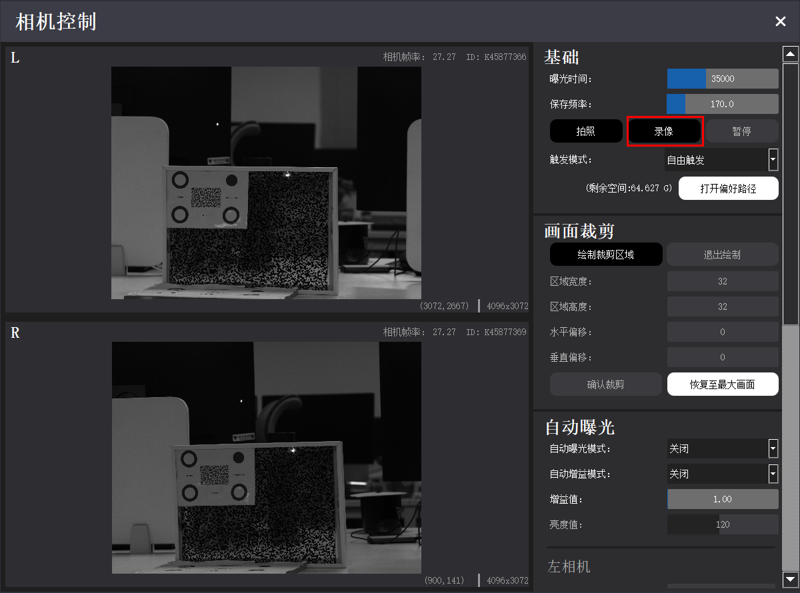 

    - 其他采集来源：其他设备采集的图像序列也可用于 VDA 离线分析。

        (1) 首先需进行图像转换与命名。进入导航栏 → 工具 → 图像转换，“待转换文件夹”选择需要转换的图像文件夹，“图片类型”选择图像原格式；在“导出命名规则”中设置图像命名是否加上 left_ 或 right_，“导出文件夹”选择导出路径。
    
        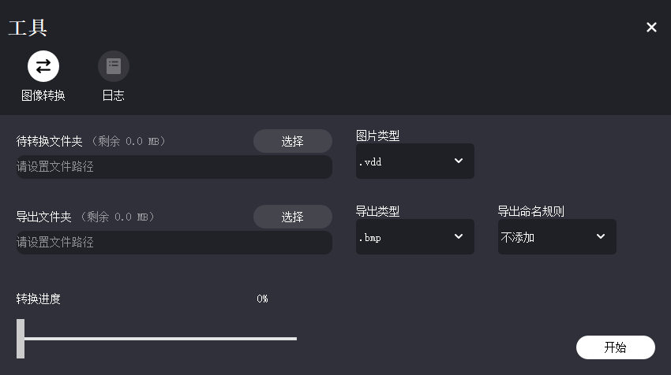

        (2) 完成图像转换后，新建离线分析文件夹。按前面所述的文件组成，将必备的文件拷贝至文件夹内，并修改文件名为指定形式。
     
2. 在主界面 → 离线分析配置区，点击【打开分析文件夹】，选择离线分析文件夹。若文件被成功识别，界面将展示分析类型（2D 或 3D）及预览图。点击【下一步】，进入离线分析页。

    
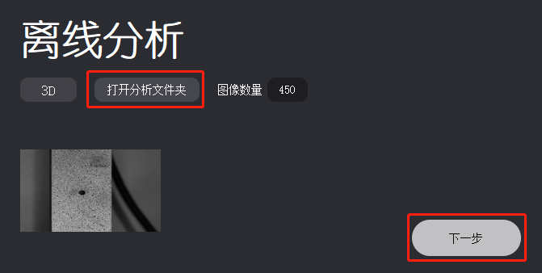
   

3. 在离线分析页 → 分析控制区 → 分析控制页，可调整分析间隔与分析进度；点击【分析参数】 → 输出 → 存储回放数据，设置是否存储数据用于分析结果回放。

    

4. 之后的操作步骤与 <a href="#OnlineAnalysis">在线分析</a> 基本一致。

### 分析结果

#### 全场应变云图

在云图显示区，可通过云图上方的设置栏调整当前云图的显示方式。将光标置于云图点位上，可查看该点对应的分析数据。云图右边的彩色条形为色带，旁边标注有数据范围，用于对比查看云图中的应变值。

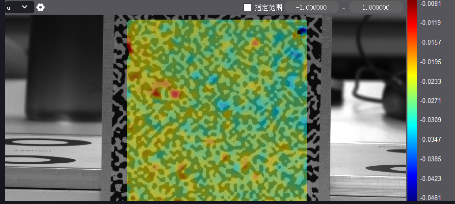

- 点击云图左上角的下拉框，选择 u/v/w 或 exx/eyy/exy/e1/e2，可切换不同分析分量的云图。

- 点击  可保存云图。.csv 格式可保存云图所有的点位信息，.jpg 格式可保存为图片形式。可设置是否保存色带、图像中颜色过度程度。

- 点选“指定范围”，可修改色带值的上下限。

#### 刚性位移曲线

在曲线面板区 → 曲线显示设置栏，可调整当前应变曲线的显示方式。将光标置于曲线点位上，可查看该点对应的分析数据。

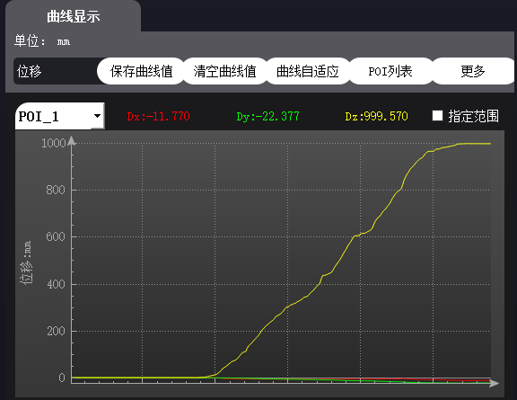

| 选项 | 说明 |
| ---- | ---- |
| 曲线展示切换 | 下拉选择不同分析指标的曲线信息，可选择位移/速度/加速度/频谱/应变。应变功能需要在分析前进行增加点操作，其他则与位移曲线相同，开始分析即可显示）点应变曲线需要两个点以上才可使用，分析前进行点的增加即可进行分析。 |
| 保存曲线值 | 将选中曲线的数值信息保存为.csv 文件。 |
| 清空曲线值 | 清空当前显示的曲线。 |
| 曲线自适应 | 使曲线缩放至与视图最匹配的大小。 |
| POI 列表 | 查看当前 POI 的分析值与置信度。 |
| 更多 - 显示设置 | 显示筛选：勾选显示不同坐标方向曲线。 滤波：对分析数据进行滤波，使曲线更平滑。 显示最新：显示对应数值的曲线长度，不勾选则一直更新。 |
| 更多 - 保存设置 | 设置需要保存分析曲线中的哪些信息。 |
| 更多 - 更新设置 | 自动保存全部数据：勾选后生效，可选择按最近数量或最近时间保存。 分析间隔：可指定在线分析的频率，在分析结果中表示为曲线个数产生的间隔，具体分析速度取决于采样帧率与电脑性能。 |
| 指定范围 | 输入范围值，改变曲线纵坐标显示范围值。 |

### 分析回放

如果离线分析时选择保存回放数据，之后可查看结果回放。回放数据包含分析参数、ROI/POI、分析结果云图/曲线等信息，回放过程中无法修改分析参数，但可调整回放速度与区间，可在结果显示区调整云图/曲线显示形式、保存数据等。

- **结果回放**

    在分析控制区 → 回放控制页，选择回放数据。拖动下方进度条可调整回放速度与回放区间，点击【开始】查看分析回放。

    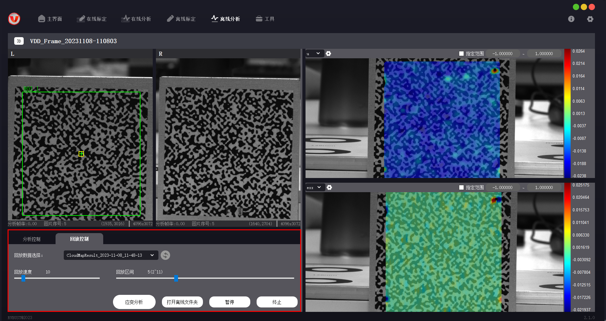

- **应变分析**

    对于全场应变版本，离线分析回放时，可通过应变分析功能提取数据信息。操作步骤如下。

    (1) 点击【应变分析】，打开应变曲线分析弹窗，弹窗内显示视图与 ROI 信息。

    (2) 在视图中点击点位（最多可选择 20 个点），勾选需要分析的应变方向，点击【开始分析】。

    (3) 分析完成后，视图下方会展示每个点对应的数据曲线。在曲线显示区点击选中曲线，点击【曲线自适应】，可根据数值变化大小，调整曲线显示范围；点击【保存曲线值】，可将曲线数据信息保存至偏好路径中。

    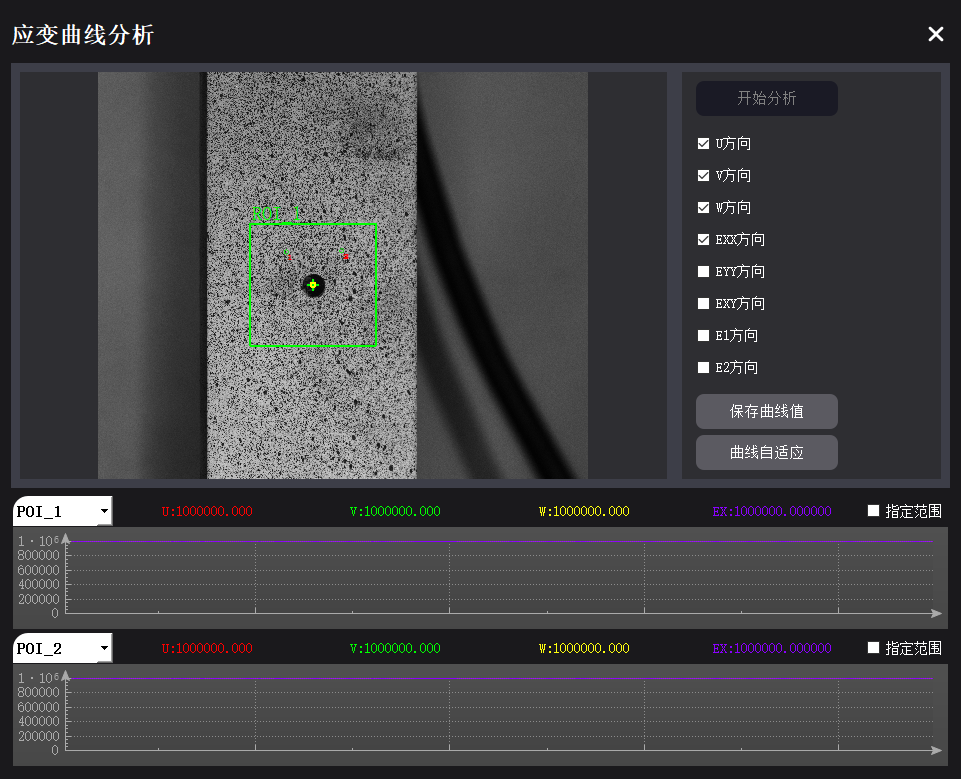