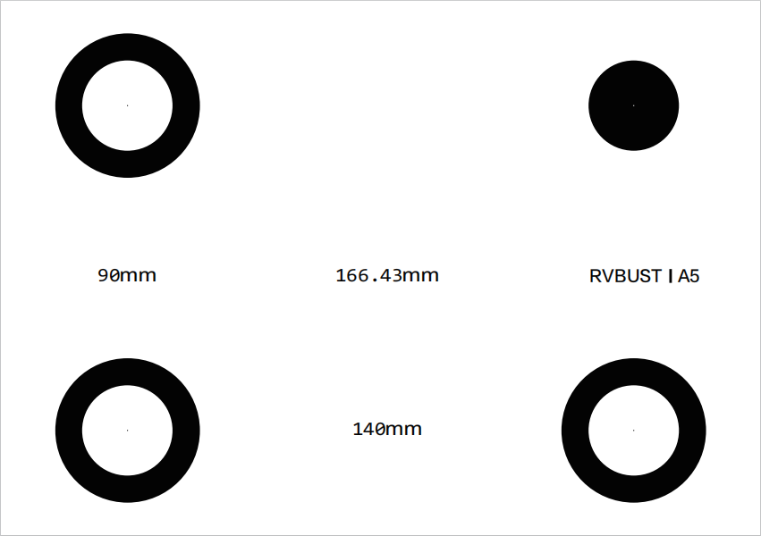
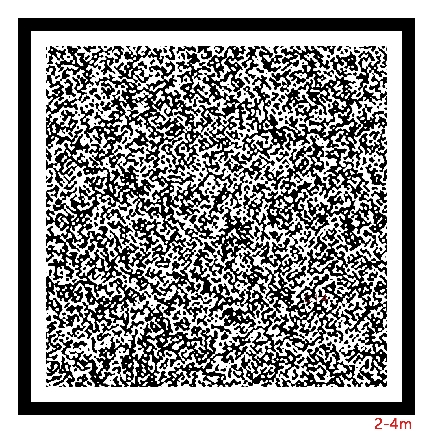
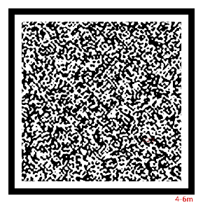
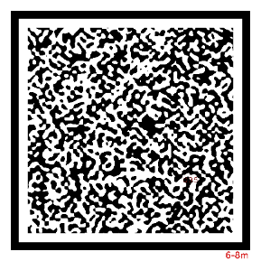
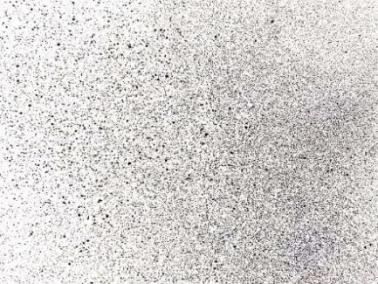
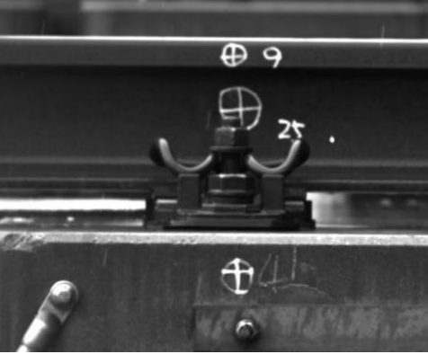
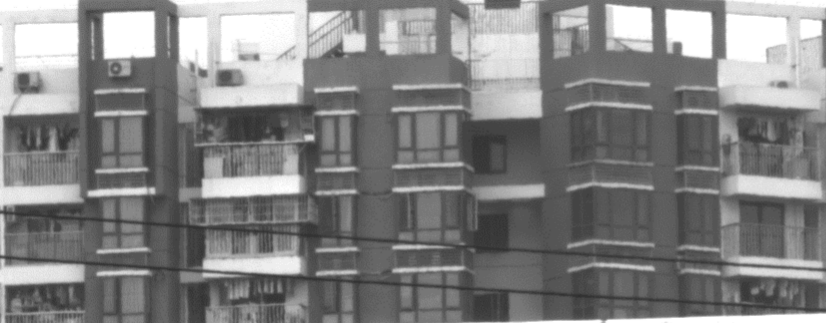

# 标记物选择

## VDA 标定板

随设备配有四点标定板。标定板规格有 A0 — A12 大小，可根据测试场景，选取相应尺寸的标定板。

## 测量标记

清晰的目标标记可使 VDA 系统实现更有效的测量。如果被测点本身有纹理、特征，可以不做标记，否则需要做标记。对于长期测量，必须做特定的靶点标记，使得被测点稳定存在。做标记的要点如下：

- 有条件粘贴、涂绘规定纹理散斑的，建议粘贴、涂绘。

- 有条件安装、固定测量靶标的，建议安装靶标。

- 如果无法粘贴、涂绘、安装散斑和靶标，需选择目标平面纹理丰富的区域作为分析 POI/ROI。

### 标记图案

理想的目标点应均匀包含亮、暗区域，常用的标记图案包括 VDA 码、散斑图案、标记笔涂记图案、自然纹理图案 4 种。

- **VDA 码**

    推荐使用本公司配套的 VDA 码，针对 VDA 分析算法性能最佳、速度最快。使用时，需将标准 VDA 码按 1:1 比例打印在纯白纸张上（如 A4 打印纸或白底不干胶等），然后平整地贴在平板上。如果粘贴时有凸起，会影响测量精度。
    
    不同型号 VDA 码适合不同距离的测量。标准 VDA 码型号见下表，型号代码中的数字代表适配最近与最远测量距离（单位：m）。随设备配有散斑印章，印章有不同尺寸以及不同颗粒度。如需购买或定制 VDA 码，请联系本公司销售。

    | 型号 | VDA0204 | VDA0406 | VDA0608 |
    | :----: | :----: | :----: | :----: |
    | 工作距离 (m) | 2—4 | 4—6 | 6—8 |
    | 图例 |  | |  |

- **散斑图案**

    喷射白色漆至待测对象表面，随后喷射黑色漆，得到表面黑白均匀的散斑图像。喷漆时可通过不规则破坏喷头，调整喷射散斑的大小；也可将附有白色粉末的模板章按压于待测对象表面，得到清晰的散斑图像。
    
    散斑图像可有效实现目标的精准跟踪，但目标变形明显时，测量精度会降低。

    

- **标记笔涂记图案**

    通过标准标记笔手动画标记点。标记笔法适用于大型伸长材料测试。

    

- **自然纹理图案**

    对于无法直接人工加装 VDA 码或添加标记图案的目标，也可以寻找自然纹理。例如建筑、桥梁、工程设施表面结构纹理等。以下图的建筑为例，可选择窗框边缘黑白交界处作为标记。

    

