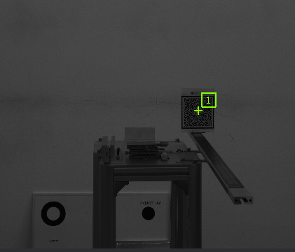
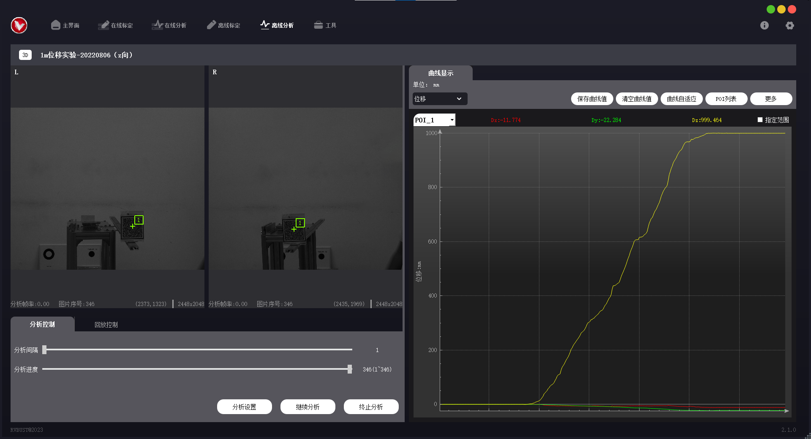
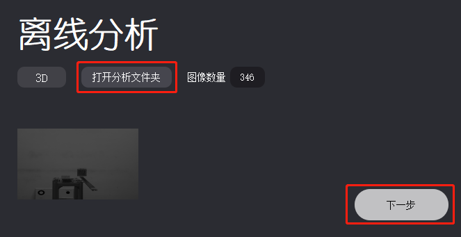
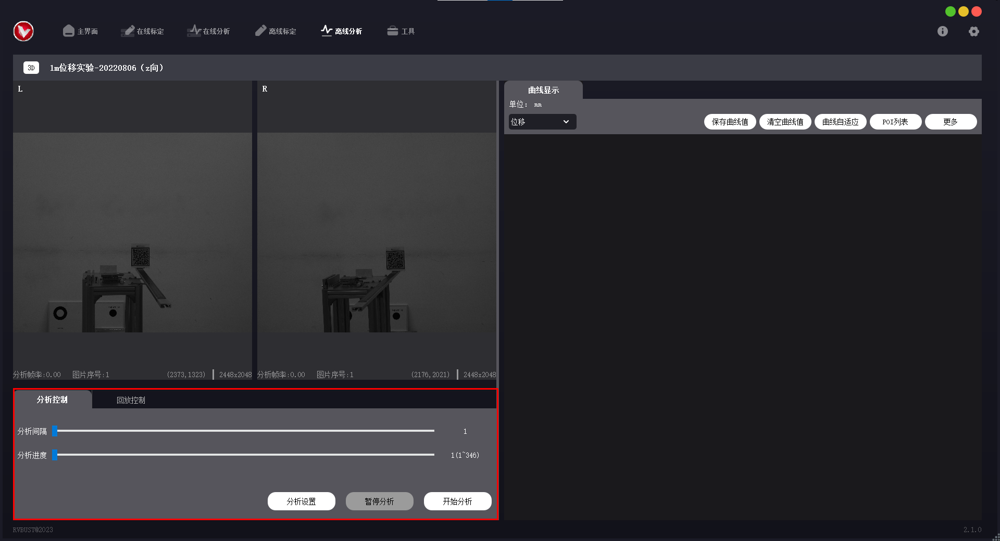
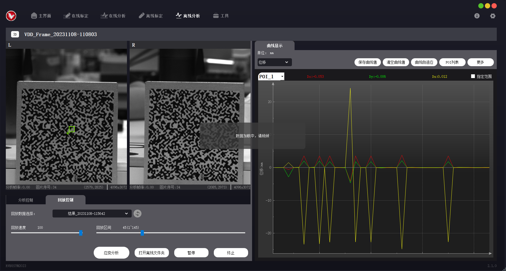

# 刚性位移分析

完成标定后，即可进行分析。本章描述如何使用 VDA Rigid Analyzer 软件进行刚性位移分析。

## 在线分析

在线分析分为 2D 在线分析与 3D 在线分析。3D 在线分析要求设备必须进行过标定，2D 在线分析可以不标定。标定过的设备可分析实际位移 (mm)，未标定的设备只能分析像素位移。

操作前，需先检查成像效果，使得被测物位于相机视野范围内，成像清晰且亮度适中。

!!! caution "注意"
    标定完成后，仅允许调节镜头光圈，不允许调节镜头焦距、挪动设备或被测物，否则会影响后续分析工作。

### 操作步骤

1. 在主界面 → 在线分析配置区，选择对应的设备，点击【确认】打开在线分析页。

    

2. 点击【分析设置】，弹出分析参数设置窗口。在相机视图中选择感兴趣点 POI (Point of Interest)，选取 POI 时的鼠标 + 键盘操作方式见下表。 

    

    | POI 操作 | 方法 |
    | ---- | ---- |
    | 添加 POI | 鼠标左键单击。 |
    | 删除 POI | 鼠标右键单击，逐次取消之前选择的 POI。 Ctrl + 鼠标右键单击，选中指定的 POI 并删除。 |
    | 移动 POI | Ctrl + 鼠标左键拖动。 |  
    | 修改指定 POI 参数 | Ctrl + 鼠标左键，选中指定的 POI 后进行参数修改。 |

    

    

3. 在分析参数设置窗口修改“子集宽度”“子集高度”数值，相机视图中将以黄色方框标记出子集区域。调整参数值，确保子集区域内包含足够多的纹理变化。其他分析参数可视情况调整，参数解释详见 <a href="#RigidPara">刚性位移 - 分析参数分类说明</a>。

    

4. 关闭分析参数设置窗口，点击【开始分析】。若启动成功，曲线面板区将显示实时位移曲线。

    

5. 对于 3D 设备，若未检测到深度信息，将出现提示框，跳转至深度计算。
   
    (1) 根据相机视图，判断被测物上距离相机基线最近、最远的点。
   
    (2) 根据提示，在左、右相机视图中，依次选择上一步中确定的最近点与最远点。左、右相机视图中的点位应依次对应。

    

    深度计算完成后，点击【确定】，回到在线分析页。再次点击【开始分析】，若启动成功，曲线面板区将显示实时位移曲线。

### 分析参数

#### 分析参数分类说明

分析参数设置窗口中的参数分类及解释如下。将光标置于参数选项上，可查看参数解释与操作说明。

- **通用参数**

    基本设置参数。

    | 参数 | 功能 |
    | ---- | ---- |
    | 分析模式 | 正常模式适用于小位移场景，大位移模式适用于大位移场景。 |
    | 初始估计 | 选择初始估计模式。设为手动时，需要在弹窗中选择视图上的对应点以确认距离关系，每 1 个 POI 需要选择 3 个对应点。左、右图像差距较大时建议使用，操作步骤见 <a href="#InitialGuessRigid">初始估计</a>。 |
    | 增量分析 | 本帧与第 1 帧对比无法得出结果时，通过与上一帧对比得出正确结果。通常在目标变化较大时使用，如目标被遮挡、光影变化较大、轻微自旋等。 |
    | 参考点 | 用于在干扰较大时，增加参考点，提升稳定性。选取说明见 <a href="#ReferencePoint">参考点</a>。 |
    | 标定数据 | 2D 分析时，可选择是否使用标定数据。使用标定数据可分析实际位移 (mm)，不使用则只能分析像素位移。 |
    | 回放数据 | 离线分析时可设置是否保存回放数据，启用后可查看分析结果回放。 |
    | 深度范围 | 3D 分析时，计算标定板与被测物之间的纵深距离。 |
    | 清空监测点 | 清除已设置的所有 POI，Ctrl + 鼠标单击生效。 |
    | 清空并导入监测点 | 从 poi_msg.txt 文件导入 POI 位置信息，原 POI 将被清空。 |
    | 参数重置 | 将所有分析参数恢复为默认值，Ctrl + 鼠标单击生效。 |

- **专用参数**

    用于设置位移分析参数。如需修改参数值，可拖动滑块调整，或 Ctrl + 鼠标单击输入指定数值。

    | 参数 | 功能 | 
    | ---- | ---- |
    | POI 点 X 坐标 POI 点 Y 坐标 | 当前选择的 POI 点在视图中的 X、Y 坐标。 |
    | 子集宽度 子集高度 | 分析时特征匹配区域的大小，在视图中以黄色方框区域显示。ROI 及子集区域的选取要求见 <a href="#SubsetRigid">子集区域</a>。 |
    | 分析步长 | 调整对原始图片下采样的大小，在⼦集尺⼨的 1/3 到 1/2 之间。 |
    | 最大相关系数 | 分析时特征匹配相似度约束，数值越小约束越严格，建议不超过 0.5。 |
    | 水平搜索范围 垂直搜索范围 | 被测点的水平、垂直查找范围，建议不超过子集大小的 1.5 倍。 |

#### 子集区域

选取 POI 与子集区域时，应确保子集区域包含足够多的纹理变化，在此基础上适当减小分析面积。选取子集区域较大时，可获取更丰富的纹理信息，但会增大计算量，减缓 VDA 分析速度；选取子集区域较小时，可获取的纹理信息不足，会降低 VDA 分析质量。

#### 初始估计

对于 3D 设备，VDA 默认自动匹配左、右画面。若左、右相机成像角度差异较大，自动匹配功能会失效，可手动选点进行匹配。

点击【分析设置】，在通用参数 → 初始估计中下拉选择“手动”。关闭参数设置窗口，点击【开始分析】，根据软件提示，依次进行左、右视图像素点匹配。对于每 1 个 POI，都需完成 3 组像素点匹配。

第 1 组：左视图中的第 1 点为系统选定，无法更改。使用空格键 + 鼠标滚轮放大视图，在右视图中，选择与左视图中位置对应的点。

第 2 组：在左视图中手动选择第 2 点。同样地，在右视图中选择与左视图位置对应的点。

第 3 组：在左视图中手动选择第 3 点，需确保左视图中的 3 点不共线。同样地，在右视图中选择与左视图位置对应的点。

完成匹配后，即可启动分析。

!!! caution "注意"
    选点时，需确保左、右视图中 3 点各不共线。每次选点允许 1—2 个像素的偏差，选择时请尽可能放大视图进行匹配。

#### 参考点

VDA 分析开始前，可选择是否采用参考点，参考点列表中包含当前所有 POI。若不选用参考点，将对所有 POI 区域进行独立分析；若选定 1 个参考点，该点将被视为基准点（位移值保持为 0），并分析其余 POI 区域相对于基准点位置的相对运动。

对于只有位移（没有形变或旋转）的测量目标，参考点可以设置于目标区域内的任意位置。若被测目标处于旋转状态，应选择关于旋转中心对称的一组点做测量标记，并将参考点设置于旋转中心。若被测目标发生形变，参考点应根据被测目标标记类型确定。

### 分析结果显示

在曲线面板区 → 曲线显示设置栏，可调整当前应变曲线的显示方式。将光标置于曲线点位上，可查看该点对应的分析数据。

| 选项 | 说明 |
| ---- | ---- |
| 曲线展示切换 | 下拉选择不同分析指标的曲线信息，可选择位移/速度/加速度/频谱/应变。应变功能需要在分析前进行增加点操作，其他则与位移曲线相同，开始分析即可显示）点应变曲线需要两个点以上才可使用，分析前进行点的增加即可进行分析。 |
| 保存曲线值 | 将选中曲线的数值信息保存为.csv 文件。 |
| 清空曲线值 | 清空当前显示的曲线。 |
| 曲线自适应 | 使曲线缩放至与视图最匹配的大小。 |
| POI 列表 | 查看当前 POI 的分析值与置信度。 |
| 更多 - 显示设置 | 显示筛选：勾选显示不同坐标方向曲线。 滤波：对分析数据进行滤波，使曲线更平滑。 显示最新：显示对应数值的曲线长度，不勾选则一直更新。 |
| 更多 - 保存设置 | 设置需要保存分析曲线中的哪些信息。 |
| 更多 - 更新设置 | 自动保存全部数据：勾选后生效，可选择按最近数量或最近时间保存。 分析间隔：可指定在线分析的频率，在分析结果中表示为曲线个数产生的间隔，具体分析速度取决于采样帧率与电脑性能。 |
| 指定范围 | 输入范围值，改变曲线纵坐标显示范围值。 |

## 离线分析

使用 VDA 采集的文件可进行离线分析。2D 离线分析还可使用其他来源的.bmp 图像，也可将其他格式的图片、视频转换为.bmp 图像序列，进行像素分析。3D 离线分析只能使用本软件录制的.vdd 格式视频，或将视频转换为.bmp 图像序列，进行位移分析。

离线分析操作步骤如下。

1. 准备离线分析文件夹。离线分析文件夹内的文件组成见下表。

    | 文件功能描述 | 文件名 |
    | ---- | ------------ |
    | 相机标定文件 | 31415926535A.txt | 
    | 相机采集的视频或图像序列（格式需为.vdd 或.bmp，3D 版本左、右相机图像数量与命名需一一对应） | **.vdd 视频流**： img_00000001.vdd img_00000002.vdd img_00000003.vdd …… **.bmp 图像（2D 版本）**： left_00000001.bmp left_00000002.bmp left_00000003.bmp …… **.bmp 图像（3D 版本）**： left_00000001.bmp left_00000002.bmp left_00000003.bmp …… right_00000001.bmp right_00000002.bmp right_00000003.bmp …… |
    | POI 坐标文件（可选，需要使用固定 POI 时导入） | poi_msg.txt |   

    获取离线分析文件夹的方式有 2 种：

    - VDA 软件采集：点击【相机控制】，在“基础”选项中点击【录像】，完成后点击【停止】。采集的离线分析文件夹以“VDD_Frame_拍摄时间”的形式命名，默认保存在安装路径下的 VDA_CameraFrame 文件夹内。.vdd 视频文件按拍摄时间命名，进行在线分析时，可直接选取对应的文件夹。
    
         

    - 其他采集来源：其他设备采集的图像序列也可用于 VDA 离线分析。

        (1) 首先需进行图像转换与命名。进入导航栏 → 工具 → 图像转换，“待转换文件夹”选择需要转换的图像文件夹，“图片类型”选择图像原格式；在“导出命名规则”中设置图像命名是否加上 left_ 或 right_，“导出文件夹”选择导出路径。

          

        (2) 完成图像转换后，新建离线分析文件夹。按前面所述的文件组成，将必备的文件拷贝至文件夹内，并修改文件名为指定形式。

2. 在主界面 → 离线分析配置区，点击【打开分析文件夹】，选择离线分析文件夹。若文件被成功识别，界面将展示分析类型（2D 或 3D）及预览图。点击【下一步】，进入离线分析页。
   
    

3. 在离线分析页 → 分析控制区 → 分析控制页，可调整分析间隔与分析进度；点击【分析参数】 → 通用参数 → 回放数据，设置是否存储数据用于分析结果回放。

    

4. 之后的操作步骤与 <a href="#AnalysisRigid">在线分析</a> 基本一致。

## 分析回放

如果离线分析时选择保存回放数据，之后可查看结果回放。回放数据包含分析参数、POI、分析结果曲线等信息，回放过程中无法修改分析参数，但可调整回放速度与区间，可在曲线面板区调整曲线显示形式、保存数据等。

在分析控制区 → 回放控制页，选择回放数据。拖动下方进度条可调整回放速度与回放区间，点击【开始】查看分析回放。

