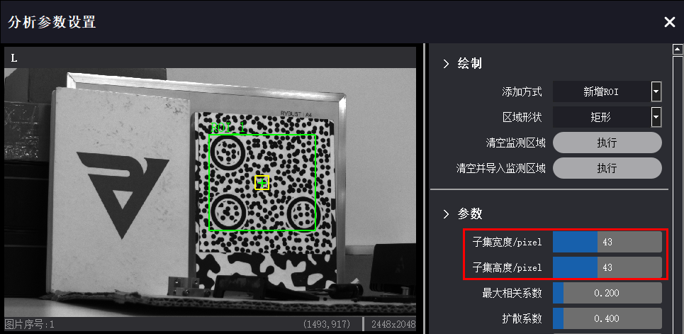
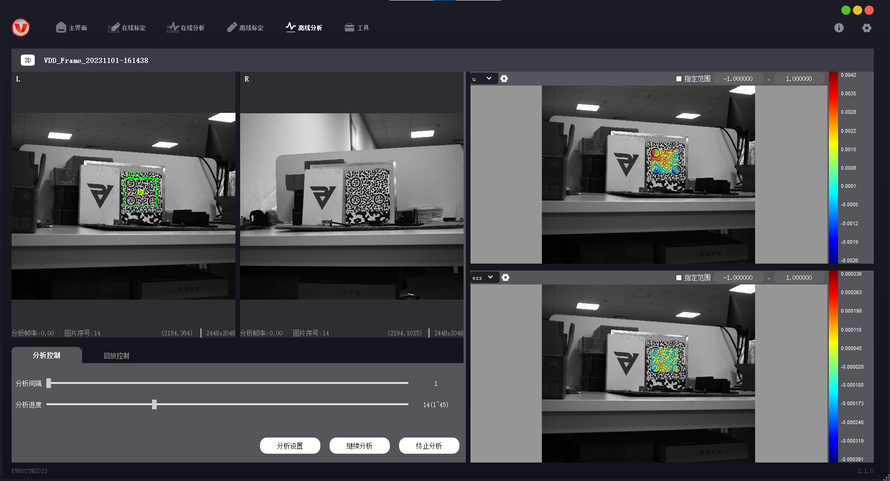

# 全场应变分析

完成标定后，即可进行分析。本章描述如何使用 VDA Strain Analyzer 软件进行全场应变分析。

## 在线分析

在线分析分为 2D 在线分析与 3D 在线分析。3D 在线分析要求设备必须进行过标定，2D 在线分析可以不标定。标定过的设备可分析实际位移 (mm)，未标定的设备只能分析像素位移。

操作前，需先检查成像效果，使得被测物位于相机视野范围内，成像清晰且亮度适中。

!!! caution "注意"
    标定完成后，仅允许调节镜头光圈，不允许调节镜头焦距、挪动设备或被测物，否则会影响后续分析工作。

### 操作步骤

1. 在主界面 → 在线分析配置区，选择对应的设备，点击【确认】打开在线分析页。

    

2. 点击【分析设置】，弹出分析参数设置窗口。在相机视图中选择感兴趣区域 ROI (Region of Interest)，选取 ROI 时的鼠标 + 键盘操作方式见下表。

    

    | ROI 操作 | 方法 |
    | ---- | ---- |
    | 添加 ROI | 鼠标左键拖动。 |
    | 删除 ROI | 鼠标右键单击，逐次取消之前选择的 ROI。 Ctrl + 鼠标右键单击，选中指定的 ROI 并删除。 |
    | 移动 ROI | Ctrl + 鼠标左键拖动。 | 

    

    

3. 在分析参数设置窗口修改“子集宽度”“子集高度”数值，相机视图中将以黄色方框标记出子集区域。调整参数值，确保子集区域内包含足够多的纹理变化。其他分析参数与输出云图类型可根据分析需求进行调整，参数解释详见 <a href="#StrainPara">全场应变 - 分析参数分类说明</a>。

    

4. 关闭分析参数设置窗口，点击【开始分析】。若启动成功，云图显示区将展示实时应变云图。

    

5. 对于 3D 设备，若未检测到深度信息，将出现提示框，跳转至深度计算。
   
    (1) 根据相机视图，判断被测物上距离相机基线最近、最远的点。
   
    (2) 根据提示，在左、右相机视图中，依次选择上一步中确定的最近点与最远点。左、右相机视图中的点位应依次对应。

    

    进行深度计算完成后，点击【确定】，回到在线分析页。再次点击【开始分析】，若启动成功，云图显示区将展示实时应变云图。

### 分析参数

#### 分析参数分类说明

分析参数设置窗口中的参数分类及解释如下。将光标置于参数选项上，可查看参数解释与操作说明。

- **绘制**

    主要用于在视图中设置 ROI 区域，参数功能说明见下表。

    | 参数 | 功能 |
    | ---- | ---- |
    | 添加方式 | 新增 ROI：新增被测区域。 新增抠除：在 ROI 中抠除不需要分析的区域，被抠除区域必须完整位于原 ROI 内。 |
    | 区域形状 | 可选择矩形、圆形、多边形，每次添加 1 个 ROI（或抠除区域）时均可设置。 |
    | 清空监测区域 | 清除已设置的所有 ROI，Ctrl + 鼠标单击生效。 |
    | 清空并导入监测区域 | 从 roi_msg.txt 文件导入 ROI 位置信息，原 ROI 将被清空。 |
    
- **参数**

    用于设置应变分析参数。如需修改参数值，可拖动滑块调整，或 Ctrl + 鼠标单击输入指定数值。

    | 参数 | 功能 |
    | ---- | ---- |
    | 子集宽度 子集高度 | 分析时特征匹配区域的大小，在视图中以黄色方框区域显示。ROI 及子集区域的选取要求见 <a href="#SubsetStrain">子集区域</a>。 |
    | 最大相关系数 | 分析时特征匹配相似度约束，数值越小约束越严格，建议不超过 0.5。 |
    | 扩散系数 | 扩散约束系数。约束越严格，图像细节信息越可能被保留。 |
    | 采样步长 | 对原始图片下采样的大小，在⼦集尺⼨的 1/3 到 1/2 之间。 |
    | 最大应变约束 | 用于过滤局部异常应变值，通常保持为 0.5 即可。 | 
    | 滤波窗口 | 均值计算时考虑的邻域范围。 |
    | 水平搜索范围 垂直搜索范围 | 被测点的水平、垂直查找范围，建议不超过子集大小的 1.5 倍。 |
    | 计算深度范围 | 3D 分析时，计算标定板与被测物之间的纵深距离。 |
    | 分析模式 | 正常模式适用于小位移场景，大位移模式适用于大位移、大形变场景。 |
    | 分析策略 | 默认模式适用于大部分场景，多种子点适用于形变较大的场景。 |
    | 初始估计 | 选择初始估计模式。设为手动时，需要在弹窗中选择视图上的对应点以确认距离关系，每 1 个 ROI 需要选择 3 个对应点。左、右图像差距较大时建议使用，操作步骤见 <a href="#InitialGuessStrain">初始估计</a>。 |
    | 使用扩展视野分析 | 使用全图信息进行分析。对旋转较大的场景分析成功率会提高，但分析速度会变慢。 |
    | 增量分析 | 本帧与第 1 帧对比无法得出结果时，通过与上一帧对比得出正确结果。通常在目标变化较大时使用，如目标被遮挡、光影变化较大、轻微自旋等。 |
    | 应变求解方法 | 可选择拉格朗日法或欧拉法。 |
    | 参数重置 | 将所有分析参数恢复为默认值，Ctrl + 鼠标单击生效。 |

- **预分析**

    ROI 与分析参数配置完成后，点击【预分析】可查看分析效果预览。对于离线分析，还会给出完整分析预估用时。

- **输出**

    对于分析结果，可选择输出的云图类型。

    | 参数 | 功能 |
    | ---- | ---- |
    | 输出云图类型 | 选择云图中显示哪些分量。 x, y, z：世界坐标 u, v, w：x, y, z 方向位移值 ex, ey：应变 exy：剪应变 e1, e2：主应变 |
    | 存储回放数据 | 离线分析时可设置是否保存回放数据，启用后可查看分析结果回放。 |
    | 存储原始数据 | 勾选后将当前显示云图的数据保存为.csv 文件，边分析边保存。 |
    | 存储图片数据 | 勾选后保存当前显示的云图，可选择图片格式 (.jpg/.bmp/.png) 及图中是否包含参考色带，边分析边保存。 |

#### 子集区域

选取 ROI 与子集区域时，应确保子集区域包含足够多的纹理变化，在此基础上适当减小分析面积。选取子集区域较大时，可获取更丰富的纹理信息，但会增大计算量，减缓 VDA 分析速度；选取子集区域较小时，可获取的纹理信息不足，会降低 VDA 分析质量。

#### 初始估计

对于 3D 设备，VDA 默认自动匹配左、右画面。若左、右相机成像角度差异较大，自动匹配功能会失效，可手动选点进行匹配。

点击【分析设置】，在通用参数 → 初始估计中下拉选择“手动”。关闭参数设置窗口，点击【开始分析】，根据软件提示，依次进行左、右视图像素点匹配。对于每 1 个 ROI，都需完成 3 组像素点匹配。

第 1 组：左视图中的第 1 点为系统选定，无法更改。使用空格键 + 鼠标滚轮放大视图，在右视图中，选择与左视图中位置对应的点。

第 2 组：在左视图中手动选择第 2 点。同样地，在右视图中选择与左视图位置对应的点。

第 3 组：在左视图中手动选择第 3 点，需确保左视图中的 3 点不共线。同样地，在右视图中选择与左视图位置对应的点。

完成匹配后，即可启动分析。

!!! caution "注意"
    选点时，需确保左、右视图中 3 点各不共线。每次选点允许 1—2 个像素的偏差，选择时请尽可能放大视图进行匹配。

### 分析结果显示

在云图显示区，可通过云图上方的设置栏调整当前云图的显示方式。将光标置于云图点位上，可查看该点对应的分析数据。云图右边的彩色条形为色带，旁边标注有数据范围，用于对比查看云图中的应变值。

- 点击云图左上角的下拉框，选择 u/v/w 或 exx/eyy/exy/e1/e2，可切换不同分析分量的云图。

- 点击  可保存云图。.csv 格式可保存云图所有的点位信息，.jpg 格式可保存为图片形式。可设置是否保存色带、图像中颜色过度程度。

- 点选“指定范围”，可修改色带值的上下限。

## 离线分析

使用 VDA 采集的文件可进行离线分析。2D 离线分析还可使用其他来源的.bmp 图像，也可将其他格式的图片、视频转换为.bmp 图像序列，进行像素分析。3D 离线分析只能使用本软件录制的.vdd 格式视频，或将视频转换为.bmp 图像序列，进行位移分析。

离线分析操作步骤如下。

1. 准备离线分析文件夹。离线分析文件夹内的必要文件组成见下表。

    | 文件功能描述 | 文件名 |
    | ---- | ------------ |
    | 相机标定文件 | 31415926535A.txt | 
    | 相机采集的视频或图像序列（格式需为.vdd 或.bmp，3D 版本左、右相机图像数量与命名需一一对应） | **.vdd 视频流**： img_00000001.vdd img_00000002.vdd img_00000003.vdd …… **.bmp 图像（2D 版本）**： left_00000001.bmp left_00000002.bmp left_00000003.bmp …… **.bmp 图像（3D 版本）**： left_00000001.bmp left_00000002.bmp left_00000003.bmp …… right_00000001.bmp right_00000002.bmp right_00000003.bmp …… |
    | ROI 坐标文件（可选，需要使用固定 ROI 区域时导入） | roi_msg.txt |

    获取离线分析文件夹的方式有 2 种：

    - VDA 软件采集：点击【相机控制】，在“基础”选项中点击【录像】，完成后点击【停止】。采集的离线分析文件夹以“VDD_Frame_拍摄时间”的形式命名，默认保存在安装路径下的 VDA_CameraFrame 文件夹内。.vdd 视频文件按拍摄时间命名，进行在线分析时，可直接选取对应的文件夹。
    
         

    - 其他采集来源：其他设备采集的图像序列也可用于 VDA 离线分析。

        (1) 首先需进行图像转换与命名。进入导航栏 → 工具 → 图像转换，“待转换文件夹”选择需要转换的图像文件夹，“图片类型”选择图像原格式；在“导出命名规则”中设置图像命名是否加上 left_ 或 right_，“导出文件夹”选择导出路径。
    
        

        (2) 完成图像转换后，新建离线分析文件夹。按前面所述的文件组成，将必备的文件拷贝至文件夹内，并修改文件名为指定形式。
     
2. 在主界面 → 离线分析配置区，点击【打开分析文件夹】，选择离线分析文件夹。若文件被成功识别，界面将展示分析类型（2D 或 3D）及预览图。点击【下一步】，进入离线分析页。

    

3. 在离线分析页 → 分析控制区 → 分析控制页，可调整分析间隔与分析进度；点击【分析参数】 → 输出 → 存储回放数据，设置是否存储数据用于分析结果回放。

    

4. 之后的操作步骤与 <a href="#AnalysisStrain">在线分析</a> 基本一致。

## 分析回放

如果离线分析时选择保存回放数据，之后可查看结果回放。回放数据包含分析参数、ROI、分析结果云图等信息，回放过程中无法修改分析参数，但可调整回放速度与区间，可在云图显示区调整云图显示形式、保存数据等。

- **结果回放**

    在分析控制区 → 回放控制页，选择回放数据。拖动下方进度条可调整回放速度与回放区间，点击【开始】查看分析回放。

    

- **应变分析**

    离线分析回放时，可通过应变分析功能提取数据信息。操作步骤如下。

    (1) 点击【应变分析】，打开应变曲线分析弹窗，弹窗内显示视图与 ROI 信息。

    (2) 在视图中点击点位（最多可选择 20 个点），勾选需要分析的应变方向，点击【开始分析】。

    (3) 分析完成后，视图下方会展示每个点对应的数据曲线。在曲线显示区点击选中曲线，点击【曲线自适应】，可根据数值变化大小，调整曲线显示范围；点击【保存曲线值】，可将曲线数据信息保存至偏好路径中。

    