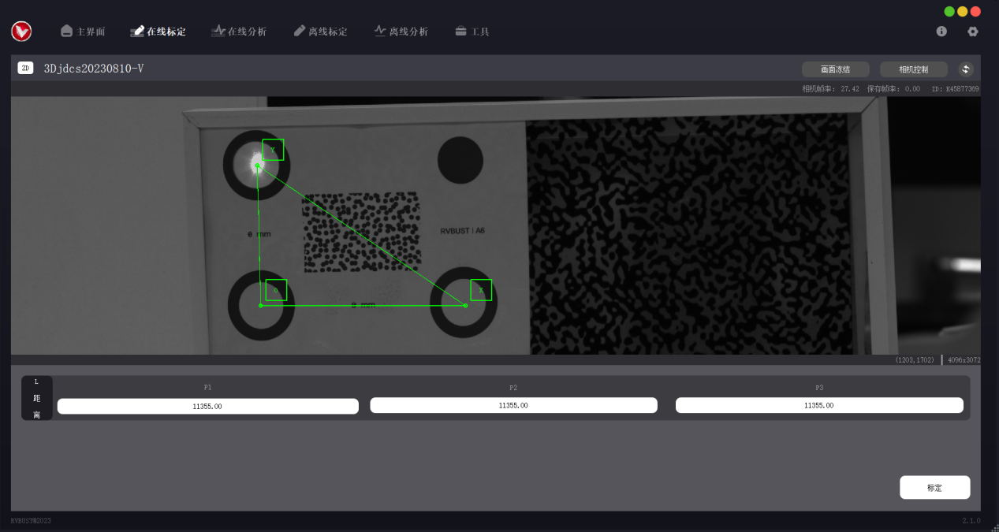
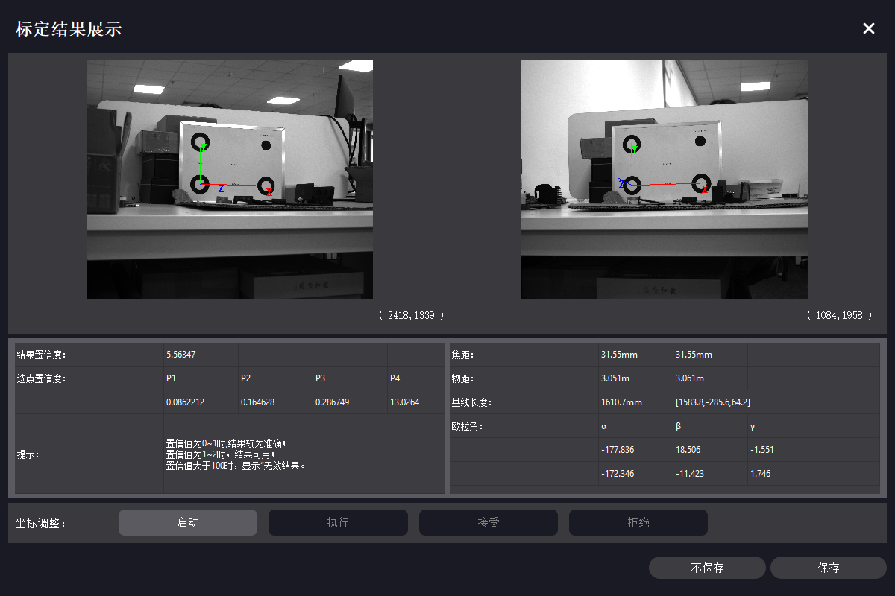
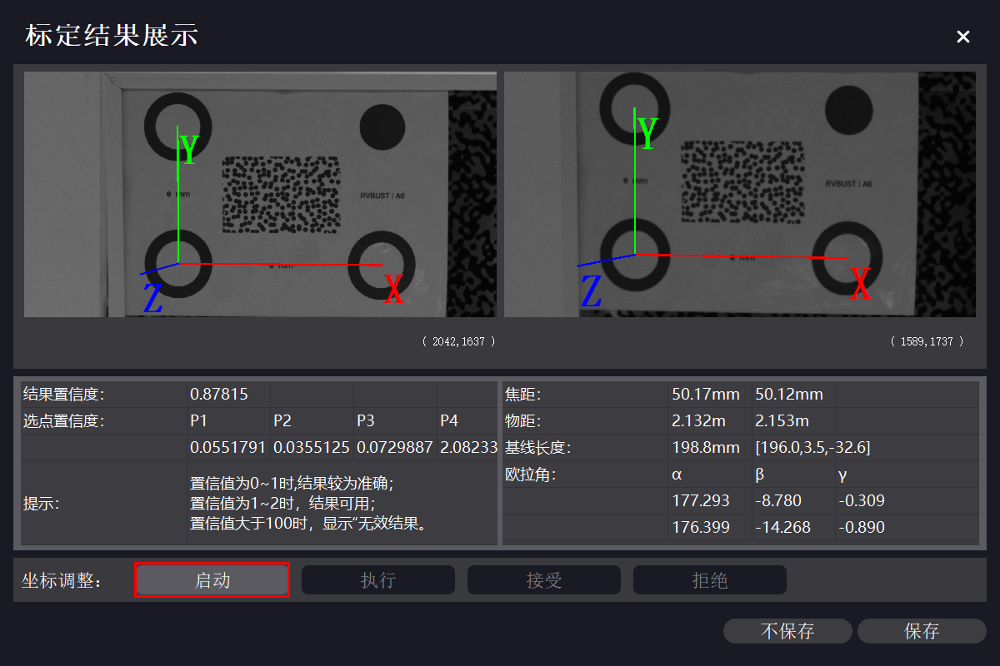
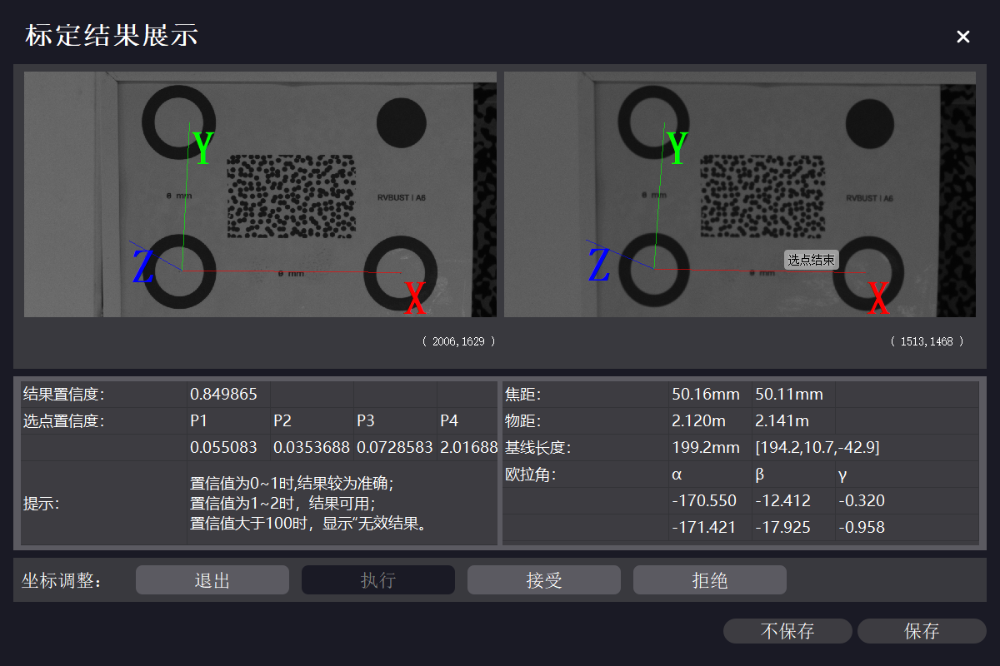

# 标定

VDA Analyzer 提供激光标定、多点标定两种标定方法，用户可根据不同使用场景选择更适合的方式。本章详述两种标定方法的操作步骤。

| 标定方法 | 支持标定模式 | 速度 | 设备要求 | 适用场景 | 
| ---- | ---- | ---- | ---- | ---- | 
| 激光标定 | 仅在线标定 | 相对较慢 | 必须带有激光测距仪 | 不方便放置标定板、距离太远、无法直接测量的场景。 | 
| 多点标定 | 在线标定、离线标定 | 相对较快 | 通用 | 可放置标定板、方便测量的场景。 |  

## 在线标定

操作前，需先按 <a href="../preparation/#AdjustView">调整成像效果</a> 调整相机视野、曝光、焦距，使得标定板（或标定区域，后同）位于相机视野范围内，成像清晰且亮度适中。

!!! tip "提示"
    通常，标定选取的点在视野内间隔较远即可。实际操作中，可选视野宽度的 1/10—1/2 作为点距，即标定板大致占视野宽度的 1/3。

!!! caution "注意"
    标定时，相机不必与标定板平面垂直，但应使标定板处于目标平面上。

!!! caution "注意"
    标定完成后，仅允许调节镜头光圈，不允许调节镜头焦距、挪动设备或被测物，否则会影响后续分析工作。

完成调整后，在主界面 → 在线标定配置区，选择设备与对应的镜头高精度文件，并在下拉框中选择“激光标定”或“多点标定”，点击【确认】打开在线标定页。

!!! caution "注意"
    如果未购买本公司工控机，主界面中镜头高精度文件将显示为空。请联系本公司客服获取高精度文件，将文件夹解压后拷贝至软件安装目录下的 CamCalibConfig 文件夹下。

### 激光标定

激光标定的原理是通过相机到目标物 3 个指定点的距离建立目标世界坐标系，激光照射的第 1、2、3 点分别确定目标世界坐标系的原点 O、x 轴正方向、y 轴正方向，在软件界面中显示为 O 点、X 点、Y 点。

!!! caution "注意"
    激光标定时选取的标定面不能反光，否则可能影响识别。

#### 2D 激光标定

1. 通过鹰眼盒背面的旋钮调整激光方向，使得相机视图中的激光点照射到所需的原点 O 的位置。

2. 单击相机视图中的激光点中心处，触发激光测距，鹰眼盒至激光点的距离将自动记录在标定数据区。按同样的方法，依次用激光确定相机视图中点 X、点 Y 的位置，并完成相应的测距。

    !!! caution "注意"
        选择 X 点时，应使射线 OX 与期望的 x 轴正方向一致；选择 Y 点时，应使射线 OY 与 OX 大致垂直。

    

3. 完成 3 点测距后，点击【标定】。计算完成后将弹出标定结果展示窗口。如果确定使用当前标定结果，点击【保存】，标定数据将自动保存至本地。

    

#### 3D 激光标定

1. 通过左鹰眼盒背面的旋钮调整左激光方向，使得左、右相机视图中，左激光点照射到所需的原点 O 的位置。

2. 同样地调整右激光方向，使得左、右相机视图中，左激光点、右激光点与原点 O 的位置均重合。

3. 依次单击左、右视图中的激光点中心处，触发激光测距，左、右鹰眼盒至激光点的距离将自动记录在标定数据区。按同样的方法，依次用激光确定左、右相机视图中点 X、点 Y 的位置，并完成相应的测距。

    !!! caution "注意"
        左、右相机的激光点必须重合。激光点重合后，左、右视图中的激光点都需要点击触发测距。

    !!! caution "注意"
        选择 X 点时，应使射线 OX 与期望的 x 轴正方向一致；选择 Y 点时，应使射线 OY 与 OX 大致垂直。           
    

4. 左、右相机均完成 3 点测距后，点击【标定】。计算完成后将弹出标定结果展示窗口。如果确定使用当前标定结果，点击【保存】，标定数据将自动保存至本地。

    

### 多点标定

多点标定的原理是通过标定板 4 个圆心之间的距离建立目标世界坐标系。标定板下排的 2 个圆心依次记为 P1、P2，上排的 2 个圆心依次记为 P3、P4。P1 确定坐标系的原点 O，P2 确定 x 轴正方向，P3 确定 y 轴正方向，P4 作为坐标系校验点。标定时建议使用 <a href="../preparation/#Caliboard">本公司定制的标定板</a>，如有订购需求，请联系本公司销售。

多点标定可自动识别标定板圆心，也可手动选点。若使用标定板进行标定，建议选择自动识别功能；若不方便放置标定板（如测量地点在户外且与设备距离较远），或自动识别失败，可采用手动选点。

#### 自动识别

!!! caution "注意"
    多点标定自动识别模式下，视野区域内不能有其他明显圆环，否则可能影响识别。

1. 使标定板尽可能位于相机视野中心位置。
    
2. 下拉选择标定板规格，在“识别方式”中点选“自动识别”。软件将自动检测标定板的 4 个圆心位置，相机视图中展示 4 个圆心与各点间的理论距离。

    

3. 完成自动识别后，点击【标定】。计算完成后将弹出标定结果展示窗口，视图中显示坐标系，下方显示标定数据。如果确定使用当前标定结果，点击【保存】，标定数据将自动保存至本地。

    

#### 手动选点   

1. 在“识别方式”中点选“手动选点”，标定板下拉框选择 NULL。
    
2. 在相机视图中用鼠标左键单击，依次选择 4 个点。P1、P2、P3 分别对应原点 O、x 轴正方向、y 轴正方向，P4 位于 xOy 平面内。如需取消选点，点击鼠标右键逐次取消。

    对于 3D 设备，左、右相机视图中各需按此操作选取 4 个点，且左、右相机视图中所选的点应按选取顺序依次对应。
    
    !!! caution "注意"
        选择 P2 点时，应使射线 P1P2 与期望的 x 轴正方向一致；选择 P3 点时，应使射线 OY 与 OX 大致垂直。
    
    

3. 通过实地测量或其他方法获取上述 4 点之间的实际距离值，在距离区中输入对应的距离值。数据填写完成后，视图上会显示距离信息，可对比实际物体，检查距离输入是否正确。

        

4. 点击【标定】。计算完成后将弹出标定结果展示窗口，视图中显示坐标系，下方显示标定数据。如果确定使用当前标定结果，点击【保存】，标定数据将自动保存至本地。
    
       

## 离线标定

用 VDA 采集的文件可进行离线标定。当标定结果需要更改时，可使用离线标定功能，利用标定文件复现在线标定场景，重新选点标定。

如果进行过标定，标定文件夹内会生成在线工程标定文件 31415926535A.txt。重新进行标定后，该文件中的标定数据会更新。需要使用新的标定结果时，可将更新后的文件 31415926535A.txt 拷贝至离线数据文件夹，替换之前的版本。

离线标定仅支持多点标定方法，操作步骤如下。

1. 准备离线标定文件夹。离线标定文件夹内的必要文件组成见下表。

    | 文件功能描述 | 2D 版本 | 3D 版本 |
    | ---- | ---- | ---- |
    | 相机高精度文件 | 31415926535A_L.txt | 31415926535A_L.txt（左相机） 31415926535A_R.txt（右相机） |
    | 相机相元大小及点位距离信息文件 | CalibrationMsg.txt | CalibrationMsg.txt |
    | 相机拍摄的标定区域图像 | calib_image.bmp | left_calib_image.bmp（左相机） right_calib_image.bmp（右相机） |

    获取离线标定文件夹的方式有 2 种：

    - 自动生成：VDA Analyzer 软件使用期间会自动触发拍照。采集的标定文件夹以“Calibration_拍摄时间”的形式命名，默认保存在安装路径下的 VDA_CameraFrame 文件夹内。进行离线标定时，可直接选取对应的文件夹。

    - 手动采集：点击【相机控制】，在“基础”选项中点击【拍照】，采集的图像默认保存在安装路径下的 VDA_CameraFrame 文件夹内。新建离线标定文件夹，按上述文件组成，将必备的文件拷贝至文件夹内，并修改图像文件名为指定形式。

        

2. 在主界面 → 离线标定配置区，点击【打开标定文件夹】，选择离线标定文件夹。若文件被成功识别，界面将展示标定类型（2D 或 3D）及预览图。点击【下一步】，进入离线标定页。

    

3. 进入离线标定页之后的操作步骤与 <a href="#MultiCalib">在线多点标定</a> 一致。

## 标定结果参数说明

| 参数 | 2D 版本 | 3D 版本 |
| ---- | ---- | ---- |
| 焦距 | 当前设备使用的镜头焦距 | 当前设备使用的镜头焦距 |
| 物距 | 相机到物体的距离 | 左物距对应左相机到物体的距离，右物距对应右相机到物体的距离 |
| 基线长度 | 无 | 左、右镜头的中轴线距离 |
| 欧拉角 | α 数值对应 x 轴绕角，β 数值对应 y 轴绕角 | α 数值对应 x 轴绕角，β 数值对应 y 轴绕角，γ 数值数值对应 z 轴绕角 |

## 坐标调整

对于 3D 标定，如果标定结果与实际基本一致，可保存数据，完成标定。若显示结果与实际相差较多，则需进行坐标调整，进行坐标系旋转或平移。

1. 在坐标调整栏点击【启动】，在左相机视图中用鼠标左键单击，依次选择 4 个点。P1、P2、P3 分别对应原点 O、x 轴正方向、y 轴正方向，P4 位于 xOy 平面内。如需取消选择，可鼠标右键单击，逐点取消。
   
     

2. 在右相机视图中，按同样的方法选取 4 个点。左、右相机视野中所选的点应按选取顺序依次对应。

       

3. 选点结束后，点击【执行】。计算完成后，视图中将更新至重新计算的坐标系，下方显示重新计算后的标定数据。
   
       
如果对此结果满意，点击【接受】，之后点击【保存】，标定数据将自动保存至本地。如果对此结果不满意，点击【拒绝】，系统将恢复至前一次标定结果，可保留前一次标定结果，或再次进行坐标调整操作。
