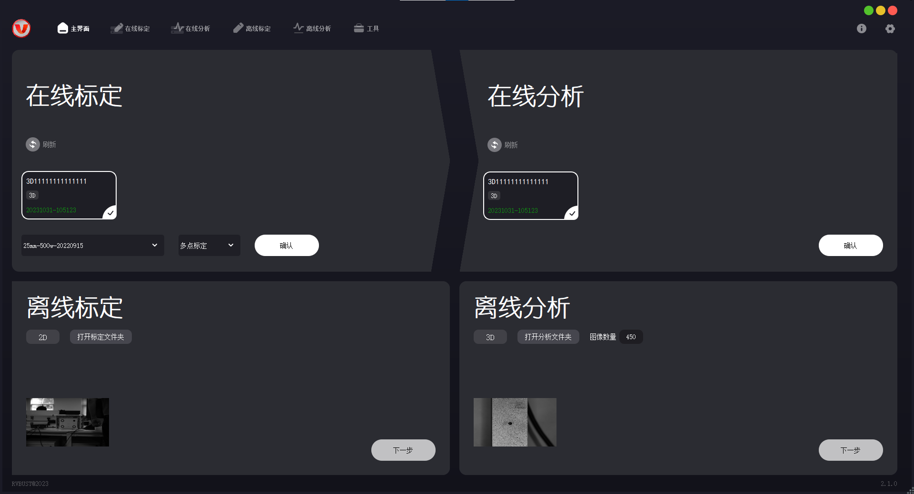
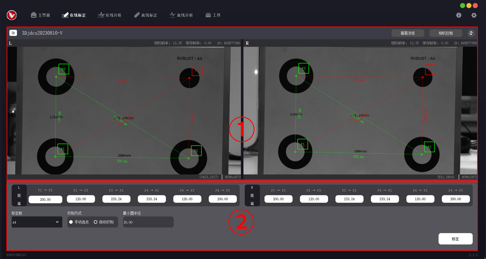
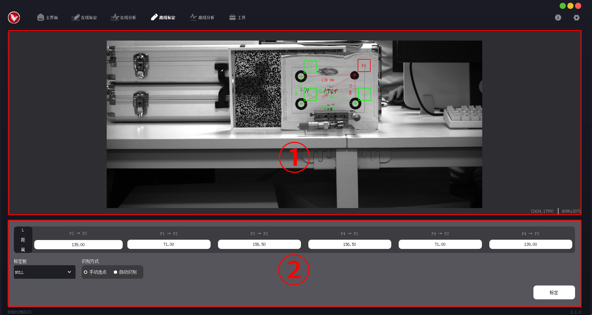
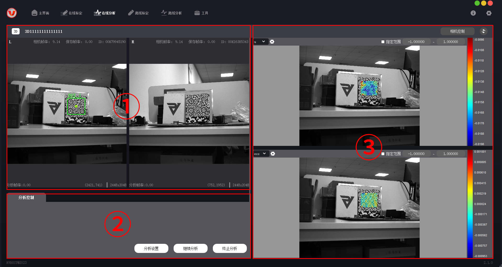
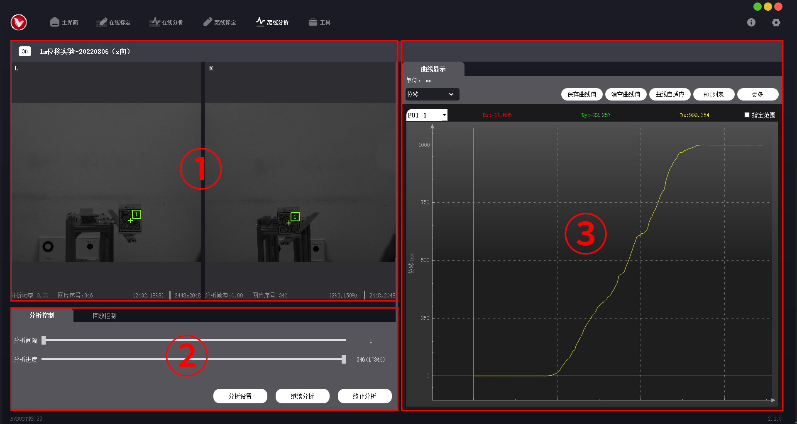
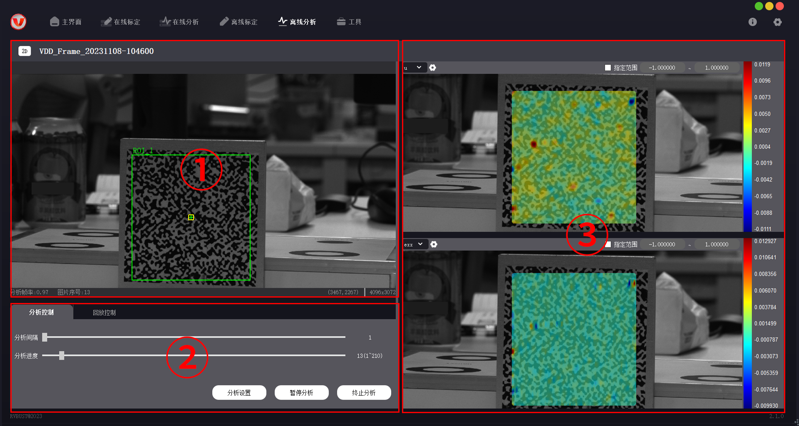

# 界面介绍

VDA Strain Analyzer（以下简称为全场应变版本）与 VDA Rigid Analyzer（以下简称为刚性位移版本）除在线分析页、离线分析页外，其他布局基本一致。下面分别介绍各页面的功能。

## 主界面

VDA Analyzer 系列软件主界面分为 4 个功能配置区（在线标定区、在线分析区、离线标定区、离线分析区），导航栏和设置选项。4 个功能配置区可进行设备配置、离线文件读取，完成后可进入对应的功能页。区域内的控件功能如下。

### 功能配置区

<table>
    <tr>
        <th>区域</th><th>控件</th><th>功能</th>
    </tr>
    <tr>
        <td rowspan="5">在线标定</td><td>刷新按钮</td><td>刷新设备信息。</td>
    </tr>
    <tr>
        <td>设备信息框</td><td>展示当前可以查找到的相机与激光设备信息。显示信息包括设备名称、类型 (2D/3D)、标定日期。已标定设备以绿色数字显示标定日期，未标定设备显示红色文字“未标定”。</td>
    </tr>
    <tr>
        <td>标定文件下拉框</td><td>选择相机的高精度标定文件。</td>
    </tr>
    <tr>
        <td>标定方式下拉框</td><td>可选择多点标定或激光标定。</td>
    </tr>
    <tr>
        <td>确认按钮</td><td>前面信息全部获取完成后，点击【确认】可打开在线标定功能页，进入在线标定。</td>
    </tr>
    <tr>
        <td rowspan="3">在线分析</td><td>刷新按钮</td><td>刷新设备信息。</td>
    </tr>
    <tr>
        <td>设备信息框</td><td>展示当前可以查找到的相机与激光设备信息。显示信息包括设备名称、类型 (2D/3D)、标定日期。已标定设备以绿色数字显示标定日期，未标定设备显示红色文字“未标定”。</td>
    </tr>
    <tr>
        <td>确认按钮</td><td>设备信息全部获取且完成标定后，点击【确认】可打开在线标定功能页，进入在线分析。</td>
    </tr>
    <tr>
        <td rowspan="3">离线标定</td><td>打开标定文件夹</td><td>选取离线标定文件夹。</td>
    </tr>
    <tr>
        <td>2D/3D</td><td>离线标定文件读取成功后，会自动识别拍摄设备的 2D/3D 信息。</td>
    </tr>
    <tr>
        <td>下一步按钮</td><td>文件读取成功后，点击【下一步】可打开离线标定功能页，进入离线标定。</td>
    </tr>
    <tr>
        <td rowspan="4">离线分析</td><td>打开分析文件夹</td><td>选取离线分析文件夹。</td>
    </tr>
    <tr>
        <td>2D/3D</td><td>离线分析文件读取成功后，会自动识别拍摄设备的 2D/3D 信息。</td>
    </tr>
    <tr>
        <td>图像数量</td><td>离线分析文件夹中的图像数量。</td>
    </tr>
    <tr>
        <td>下一步按钮</td><td>离线文件读取成功后，点击【下一步】可打开离线分析功能页，进入离线分析。</td>
    </tr>
</table>

### 导航栏

导航栏位于主界面顶部。如果已经完成设备配置、离线文件读取，可通过导航栏切换进入不同的功能页。

| 图标 | 名称 | 功能 |
| ---- | ---- | ---- |
|   | 主界面 | 打开主界面 |
|  | 在线标定 | 打开在线标定页 |
|  | 在线分析 | 打开在线分析页 |
|  | 离线标定 | 打开离线标定页 |
|  | 离线分析 | 打开离线分析页 |
|  | 工具 | 图像转换：将.vdd/.jpg/.png 格式的图像转换为.bmp 格式。通过设置导出命名规则，可在文件名中标记对应的相机。（左相机：left_；右相机：right_） |

### 设置选项

设置选项位于主界面右上角，包含软件信息与一些基本设置。

<table>
    <tr>
        <th>图标</th><th>选项</th><th>功能</th>
    </tr>
    <tr>
        <td rowspan="3"></td><td>版本</td><td>显示软件版本。</td>
    </tr>
    <tr>
        <td>查看日志</td><td>打开日志文件夹，可查看日志与配置文件。若产品使用中出现故障，可勾选“错误”“警告”，筛选日志中的信息以定位问题，也可将日志文件发送给技术支持。</td>
    </tr>
    <tr>
        <td>关于我们</td><td>进入如本科技官网 VDA 主页，查看技术参数，了解产品最新信息。</td>
    </tr>
    <tr>
        <td rowspan="5"></td><td>显示设置</td><td>设置标定与分析界面中是否显示图像和云图。</td>
    </tr>
    <tr>
        <td>保存路径</td><td>设置默认文件保存路径。</td>
    </tr>
    <tr>
        <td>导航栏显示</td><td>设置软件导航栏的图标与文字是否显示。</td>
    </tr>
    <tr>
        <td>语言</td><td>切换软件语言为简体中文/英文。</td>
    </tr>
    <tr>
        <td>采集卡</td><td>打开数据采集卡弹框，采集电流信息，实时输出。此功能仅限刚性位移版本。</td>
    </tr>
</table>

下面详述各个功能页的区域划分与功能。

## 在线标定页

| 序号 | 区域名称 | 功能 |
| ---- | ---- | ---- |
| ① | 相机视图区 | 2D 版本显示相机视图，3D 版本并列显示左、右相机视图。视图上方显示相机帧率、保存帧率、相机 ID，下方显示当前点坐标、图像尺寸。标定时选取的点会在视图上实时显示。 |
| ② | 标定数据区 | 输入标定所需的点距离、标定板大小等数据。 |

## 离线标定页

离线标定页与在线标定页布局、功能基本一致。

| 序号 | 区域名称 | 功能 |
| ---- | ---- | ---- |
| ① | 相机视图区 | 2D 版本显示相机视图，3D 版本并列显示左、右相机视图。视图下方显示当前点坐标、图像尺寸。标定时选取的点会在视图上实时显示。 |
| ② | 标定数据区 | 输入标定所需的点距离、标定板大小等数据。 |

## 在线分析页

### 刚性位移版本

| 序号 | 区域名称 | 功能 |
| ---- | ---- | ---- |
| ① | 相机视图区 | 2D 版本显示相机视图，3D 版本并列显示左、右相机视图。下方实时显示分析帧率、图片序号、当前点坐标、图像尺寸。 |
| ② | 分析控制区 | 包括分析控制、回放控制选项页。分析控制页可打开分析设置弹框，设置 ROI、分析参数、云图输出选项，并可进行预分析；回放控制页可设置回放。 |
| ③ | 曲线面板区 | 包含分析结果（位移曲线）的展示和保存设置，最多同时展示 5 条曲线。 |

### 全场应变版本

| 序号 | 区域名称 | 功能 |
| ---- | ---- | ---- |
| ① | 相机视图区 | 2D 版本显示相机视图，3D 版本并列显示左、右相机视图。下方实时显示分析帧率、图片序号、当前点坐标、图像尺寸。 |
| ② | 分析控制区 | 包括分析控制、回放控制选项页。分析控制页可打开分析设置弹框，设置 ROI、分析参数、云图输出选项，并可进行预分析；回放控制页可设置回放。 |
| ③ | 云图显示区 | 包含分析结果（云图）的展示和保存设置。 |

## 离线分析页

### 刚性位移版本

| 序号 | 区域名称 | 功能 |
| ---- | ---- | ---- |
| ① | 相机视图区 | 2D 版本显示相机视图，3D 版本并列显示左、右相机视图。下方实时显示分析帧率、图片序号、当前点坐标、图像尺寸。 |
| ② | 分析控制区 | 包括分析控制、回放控制选项页。分析控制页可打开分析设置弹框，设置 ROI、分析参数、云图输出选项，并可进行预分析；回放控制页可设置回放。 |
| ③ | 曲线面板区 | 包含分析结果（位移曲线）的展示和保存设置，最多同时展示 5 条曲线。 |

### 全场应变版本

| 序号 | 区域名称 | 功能 |
| ---- | ---- | ---- |
| ① | 相机视图区 | 2D 版本显示相机视图，3D 版本并列显示左、右相机视图。下方实时显示分析帧率、图片序号、当前点坐标、图像尺寸。 |
| ② | 分析控制区 | 包括分析控制、回放控制选项页。分析控制页可打开分析设置弹框，设置 ROI、分析参数、云图输出选项，并可进行预分析；回放控制页可设置回放。 |
| ③ | 云图显示区 | 包含分析结果（云图）的展示和保存设置。 |

