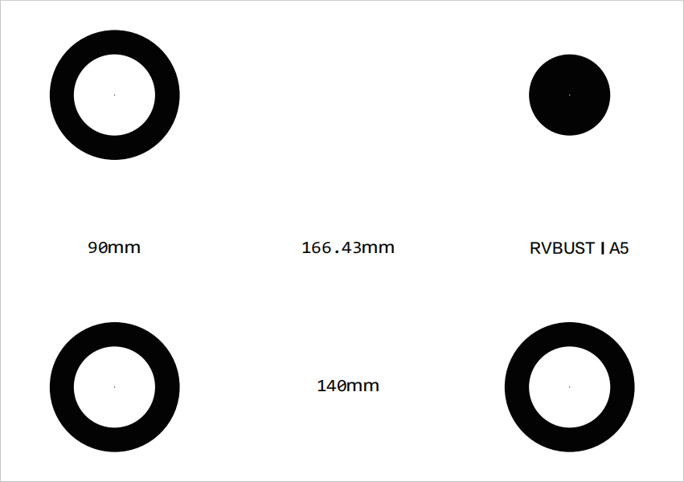

# 准备工作

使用前，应先准备标定板与测量标记，并了解软件视图、相机控制、成像效果调整等软件基本操作。

## 标记物选择

### VDA 标定板

随设备配有四点标定板。标定板规格有 A0 — A12 大小，可根据测试场景，选取相应尺寸的标定板。

### 测量标记

清晰的目标标记可使 VDA 系统实现更有效的测量。如果被测点本身有纹理、特征，可以不做标记，否则需要做标记。对于长期测量，必须做特定的靶点标记，使得被测点稳定存在。做标记的要点如下：

- 有条件粘贴、涂绘规定纹理散斑的，建议粘贴、涂绘。

- 有条件安装、固定测量靶标的，建议安装靶标。

- 如果无法粘贴、涂绘、安装散斑和靶标，需选择目标平面纹理丰富的区域作为分析 POI/ROI。

理想的目标点应均匀包含亮、暗区域，常用的标记图案包括 VDA 码、散斑图案、标记笔涂记图案、自然纹理图案 4 种。

- **VDA 码**

    推荐使用本公司配套的 VDA 码，针对 VDA 分析算法性能最佳、速度最快。使用时，需将标准 VDA 码按 1:1 比例打印在纯白纸张上（如 A4 打印纸或白底不干胶等），然后平整地贴在平板上。如果粘贴时有凸起，会影响测量精度。
    
    不同型号 VDA 码适合不同距离的测量。标准 VDA 码型号见下表，型号代码中的数字代表适配最近与最远测量距离（单位：m）。随设备配有散斑印章，印章有不同尺寸以及不同颗粒度。如需购买或定制 VDA 码，请联系本公司销售。

    | 型号 | VDA0204 | VDA0406 | VDA0608 |
    | :----: | :----: | :----: | :----: |
    | 工作距离 (m) | 2—4 | 4—6 | 6—8 |
    | 图例 |  | |  |

- **散斑图案**

    喷射白色漆至待测对象表面，随后喷射黑色漆，得到表面黑白均匀的散斑图像。喷漆时可通过不规则破坏喷头，调整喷射散斑的大小；也可将附有白色粉末的模板章按压于待测对象表面，得到清晰的散斑图像。
    
    散斑图像可有效实现目标的精准跟踪，但目标变形明显时，测量精度会降低。

    

- **标记笔涂记图案**

    通过标准标记笔手动画标记点。标记笔法适用于大型伸长材料测试。

    

- **自然纹理图案**

    对于无法直接人工加装 VDA 码或添加标记图案的目标，也可以寻找自然纹理。例如建筑、桥梁、工程设施表面结构纹理等。以下图的建筑为例，可选择窗框边缘黑白交界处作为标记。

    

## 软件基本操作

VDA Analyzer 支持在线/离线标定、在线/离线分析、视频流保存、分析数据回放，软件使用流程图如下。未连接 VDA 分析仪设备时，仅可使用流程 3/5/6，进行离线标定、离线分析、分析结果回放。

### 视图基本操作

| 视图操作 | 方法 |
| ---- | ---- |
| 移动图像 | 左右移动：空格键 + 鼠标左键拖动 上下移动：鼠标滚轮滑动，或空格键 + 鼠标左键拖动 |
| 缩放图像 | 空格键 + 鼠标滚轮或 Ctrl + 鼠标滚轮 |
| 选点 | 鼠标左键单击  |
| 取消选点 | 鼠标右键单击 |
| 删除被测点 | 逐个删除：鼠标右键 删除指定被测点：Ctrl + 右键 |
| 移动被测点 | Ctrl + 鼠标左键拖动 |
| 修改指定被测点参数 | Ctrl + 鼠标左键，选中指定的被测点后进行参数修改。 |

### 相机控制

**画面冻结**：标定时应避免相机视野内物体移动，否则可能影响识别。点击【画面冻结】，可使相机视图停留在当前画面。

**刷新按钮**：点击刷新按钮，可刷新相机。

**相机控制**：标定与分析过程中，点击【相机控制】可调整相机成像。具体选项如下：

- **基础**

    基础调节选项见下表。

    | 选项 | 功能描述 |
    | ---- | ---- |
    | 曝光时间 | 手动调整相机曝光，相机画面实时变化。 |
    | 保存频率 | 调整保存频率、录像帧率。调整数值大于本身相机帧率时，按相机本身最大帧率保存。 |
    | 拍照 | 拍摄当前图像，以.bmp 格式保存在偏好路径中。 |
    | 录像 | 点击后录制视频，点击【暂停】可暂停。视频以.vdd 格式保存在偏好路径中。 |
    | 触发模式 | 自由模式为单纯的 USB 接线模式，软触发为同步触发模式。 软触发相机会接收外部触发信号进行拍照。3D设备建议使用软触发保证左右相机图片的同步性 |
    | 打开偏好路径 | 打开 VDA 采集图像/视频的默认保存文件夹。 |

- **画面裁剪**

    进行分析之前，可通过画面裁剪功能缩小视图区域，以减少图像中的多余信息。标定过程则必须在全幅视图下完成，不可进行画面裁剪。 

    点击【绘制裁剪区域】，拖动鼠标裁剪相机视图。也可修改下方的区域宽高、偏移数值调整画面大小，完成后点击【确认裁剪】。如果需要取消裁剪，点击【恢复至最大画面】恢复原始视图。

    双目设备裁剪时，左右相机的裁剪区域是一样的。

    

- **自动曝光**

    调整相机曝光/增益值。增益值越高，画面对比效果越明显；亮度值越高，画面越亮。操作步骤如下：

    (1) 选择相机曝光/增益模式为自动或手动。手动模式下，可在“曝光值”“增益值”输入数值直接直接修改。

    

    (2) 自动模式下，相机需根据设置的自动曝光区域 (AOI: Area of Interest)，自动调节曝光值/增益值。点击【绘制 AOI】，拖动鼠标选择 AOI 区域。也可修改下方的宽高、偏移数值调整 AOI 大小。勾选“快捷 AOI”选项，可选择常规曝光区域，如视野中心点等。
    
    (3) 完成后点击【确认曝光区域】。如果需要取消当前 AOI，点击【全幅自动曝光】恢复原始曝光区域。 

## 调整成像效果

完成设备安装并确保电源可靠连接后，调整相机与标定板（或被测物，后同）的位置。2D 版本应使标定板对准相机，3D 版本应使标定板居中对齐相机基线（即左、右相机光心连线中点）。

在主界面 → 在线标定配置区，选择设备与对应的镜头高精度文件，并在下拉框中选择“激光标定”或“多点标定”，点击【确认】打开在线标定页。

!!! caution "注意"
    如果未购买本公司工控机，主界面中镜头高精度文件将显示为空。请联系本公司客服获取高精度文件，将文件夹解压后拷贝至软件安装目录下的 CamCalibConfig 文件夹下。

### 1. 调整视野

调节设备的高度及俯仰角，使得标定板或目标区域位于相机视图的正中间。调整步骤如下。

- **2D 版本**

    (1) 调节三脚架，大致确定设备高度。

    (2) 调节云台旋钮，使得目标区域位于相机画面中间位置。调节完成后，锁死云台方向调节旋钮。

    (3) 如果需要调节设备俯仰，先松开云台上的旋钮，同时用单手轻扶鹰眼盒下半部分（请勿握持摄像和激光模块），平稳旋转调节视野后，锁死云台上的旋钮。

- **3D 版本**

    (1) 调节三脚架，大致确定设备高度。

    (2) 调节云台旋钮与铝合金平台两端的旋钮，使得目标区域均位于左、右相机画面的中间位置。调节完成后，锁死云台旋钮。

    (3) 如果需要调节设备俯仰，先松开相应的制动螺旋，同时用单手轻扶铝合金平台（请勿握持摄像和激光模块），平稳旋转调节视野后，锁死对应的制动旋钮。

### 2. 调整焦距

如果成像不清晰，可使用镜头上的调焦旋钮调整焦距。

!!! caution "注意"
    请保证两个相机成像的清晰度。相机标定开始时，需要调节对焦质量；标定结束之后，请勿再次调节对焦旋钮，光圈旋钮可以根据实际情况选择是否调节。

### 3. 调整曝光 

成像区域过曝时，应适当调小镜头的光圈旋钮，或降低环境光源强度；成像区域曝光不足时，应适当调大镜头的光圈旋钮，或增强环境光源强度。如果调节镜头结果不佳，可在 VDA Analyzer 软件中进入相机控制功能调节曝光值，操作详见 <a href="#CameraControl">相机控制</a>。

!!! tip "提示" 
    测量环境光线强烈时，建议使用 11 及以上的光圈值；光线适中时，建议使用 4 至 11 的光圈值；光线较弱时，建议使用 4 以下的光圈值。

!!! caution "注意"
    对于 3D 版本，需确保左、右镜头的光圈一致。
